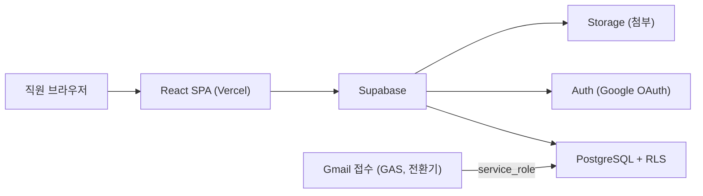
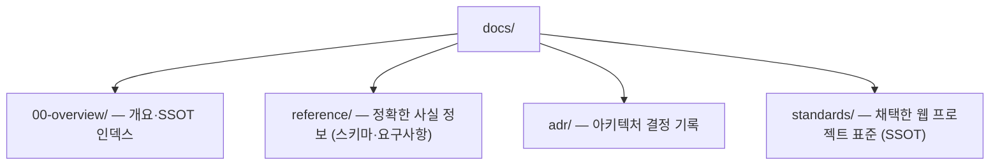

# 문서 개요 · SSOT 인덱스

이 문서는 프로젝트 문서 전체의 **단일 진입점**이다. "이 주제는 어느 문서에서 정의하는가"를 여기 한 곳에서 관리한다. 같은 내용을 여러 문서에 중복 서술하지 않고, 항상 아래 표의 SSOT 문서로 링크한다. (근거: `docs/standards/04-document-management-rules.md` §1.2)

## 시스템 개요

배움·배론·허브 3개 기관 직원(약 50명)의 업무요청을 웹으로 접수하고 시스템팀이 진행 관리하는 사이트. 기존 Gmail 접수의 분류 불일치·자동추적 한계를 접수 단계 구조화로 해결한다.

| 항목 | 값 |
|------|-----|
| 프론트엔드 | React 18 · Vite 5 · TypeScript · Tailwind · React Router · TanStack Query |
| 백엔드 | Supabase (PostgreSQL · Auth · Storage · RLS) |
| 배포 | Vercel |
| 인증 | Supabase Auth · Google OAuth · `@baeoom.com`/`@baeron.com` 도메인 제한 |
| 역할 | staff(일반직원) / system(시스템팀) / viewer(열람) |

## 주제 → SSOT 문서 매핑

| 주제 | SSOT 문서 |
|------|-----------|
| 프로젝트 규칙 · 표준 요약 · 영향 매핑 | `CLAUDE.md` (저장소 루트) |
| DB 스키마 · RLS · 트리거 · 뷰 | `docs/reference/db-schema.md` (원천: `schema.sql`) |
| 화면별 기능 요구사항 · 역할별 권한 | `docs/reference/requirements.md` |
| DB 네이밍 표준 (약어·예약어·접미사) | `docs/standards/01-database-naming-rules.md` |
| 테이블·컬럼 설계 표준 (접두사·감사컬럼·PK) | `docs/standards/02-table-column-standards.md` |
| 데이터 관리 (마이그레이션·시드·시크릿) | `docs/standards/03-data-management-rules.md` |
| 문서 관리 규칙 (docs-as-code·Diátaxis) | `docs/standards/04-document-management-rules.md` |
| 아키텍처 결정 기록 | `docs/adr/` |
| 릴리스 변경 이력 | `CHANGELOG.md` (저장소 루트) |
| DB 마이그레이션 (forward-only) | `supabase/migrations/README.md` |

## 문서 디렉토리 구조 (Diátaxis 기반)

- **reference**: 작업 중 확인용 사실 정보 (스키마 명세, 요구사항 정의).
- **standards**: 외부에서 채택한 범용 표준. 이 저장소에서도 SSOT로 관리하며 변경 시 이력을 남긴다.
- **adr**: 되돌리기 어려운 기술 결정의 맥락·이유 기록.
