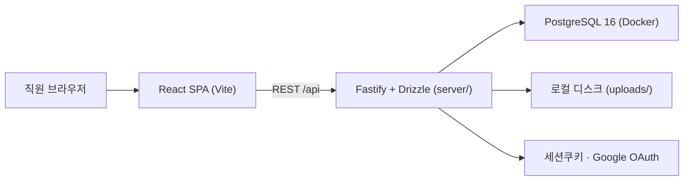
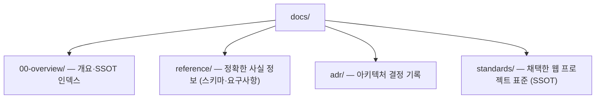

# 문서 개요 · SSOT 인덱스

이 문서는 프로젝트 문서 전체의 **단일 진입점**이다. "이 주제는 어느 문서에서 정의하는가"를 여기 한 곳에서 관리한다. 같은 내용을 여러 문서에 중복 서술하지 않고, 항상 아래 표의 SSOT 문서로 링크한다. (근거: `docs/standards/04-document-management-rules.md` §1.2)

## 시스템 개요

배움·배론·허브 3개 기관 직원(약 50명)의 업무요청을 웹으로 접수하고 시스템팀이 진행 관리하는 사이트. 기존 Gmail 접수의 분류 불일치·자동추적 한계를 접수 단계 구조화로 해결한다.

| 항목 | 값 |
|------|-----|
| 프론트엔드 | React 18 · Vite 5 · TypeScript · Tailwind · React Router · TanStack Query · REST 클라이언트 |
| 백엔드 | Fastify 4 REST API + Drizzle ORM (`server/`) |
| DB | 자체호스팅 PostgreSQL 16 (Docker) |
| 인증 | 세션 쿠키(서버측 저장소) · Google OAuth · dev-login(로컬) · `@baeoom.com`/`@baeron.com` 도메인 제한 |
| 권한 | 앱 계층 authz (`server/src/authz.ts`) |
| 스토리지 | 로컬 디스크 (`server/uploads/`) |
| 역할 | staff(일반직원) / system(시스템팀) / viewer(열람) |

> Supabase에서 자체호스팅 PostgreSQL + Fastify/Drizzle 스택으로 이전 완료. 상세: `docs/superpowers/specs/2026-07-11-supabase-to-postgres-migration-design.md`.

## 주제 → SSOT 문서 매핑

| 주제 | SSOT 문서 |
|------|-----------|
| 프로젝트 규칙 · 표준 요약 · 영향 매핑 | `CLAUDE.md` (저장소 루트) |
| DB 스키마 (정본) | `server/src/db/schema.ts` (Drizzle) + `server/drizzle/*.sql` |
| REST API 계약 · 백엔드 구조 | `server/src/routes/*.ts`, `server/src/authz.ts` |
| 인프라 이전 설계 | `docs/superpowers/specs/2026-07-11-supabase-to-postgres-migration-design.md` |
| 프로세스·프론트 재정비 (통합 설계) | `docs/superpowers/specs/2026-07-11-redesign-on-postgres-stack.md` |
| 화면별 기능 요구사항 · 역할별 권한 | `docs/reference/requirements.md` |
| DB 네이밍/설계/데이터/문서 표준 | `docs/standards/01`~`04` |
| 아키텍처 결정 기록 | `docs/adr/` |
| 릴리스 변경 이력 | `CHANGELOG.md` (저장소 루트) |

## 문서 디렉토리 구조 (Diátaxis 기반)

- **reference**: 작업 중 확인용 사실 정보 (스키마 명세, 요구사항 정의).
- **standards**: 외부에서 채택한 범용 표준. 이 저장소에서도 SSOT로 관리하며 변경 시 이력을 남긴다.
- **adr**: 되돌리기 어려운 기술 결정의 맥락·이유 기록.
