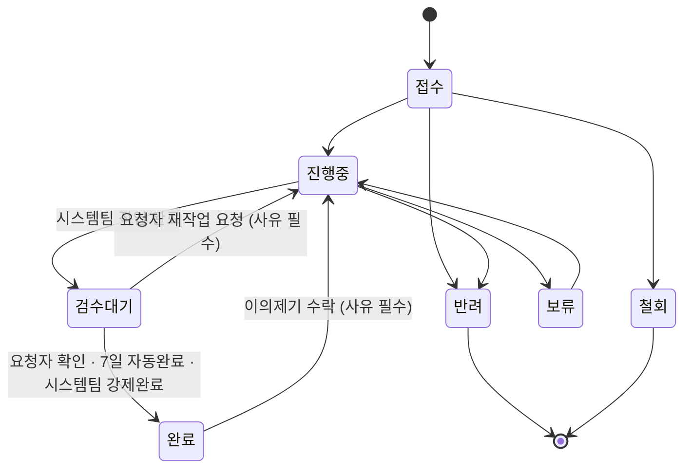

# 업무요청 접수·관리 사이트 — DB 스키마 설계 (Drizzle + Postgres 16)

정본 스택: Postgres 16 (Docker) + Fastify + Drizzle ORM.
스키마 정의: `server/src/db/schema.ts` (Drizzle).
마이그레이션: `server/drizzle/0000_*.sql` (Drizzle 자동생성) + `server/drizzle/0001_triggers.sql` (수작성 트리거·뷰).

---

## 1. 테이블 구조

| 테이블 | 역할 | 핵심 |
| --- | --- | --- |
| `users` | 직원 계정·역할·소속 | role = staff / system / viewer |
| `sessions` | 서버 세션 | 쿠키는 랜덤 토큰만 저장, 로그아웃·무효화 가능 |
| `org_directory` | 조직도 사전등록 | synced 여부로 계정 생성 연동 |
| `request_types` | 요청 유형 코드 | 오류 / 기능요청 / 데이터추출 / 파일변경 |
| `sla_policy` | SLA 응답·해결 기준 | priorityLevel(P1~P4) 기준 분 단위 |
| `holidays` | 공휴일 | SLA 비즈니스일 계산용 |
| `requests` | 접수 원장 | 상태 6종, 우선순위(P1~P4), intake_detail, CSAT |
| `request_comments` | 처리 코멘트 | isInternal 플래그(내부/외부) |
| `request_status_history` | 상태 변경 이력 | 트리거 자동 기록, changed_by = app.user_id |
| `request_attachments` | 첨부 메타 | commentId(nullable) 연결 가능 |
| `request_shared_targets` | 공유 대상 | visibility='shared'일 때 대상 목록 |
| `request_disputes` | 완료 후 이의제기 | 완료 후 14일 이내, 동시 열린 이의 1건 제한(부분 유니크 인덱스) |

관계: `requests` 1→N `comments` / `history` / `attachments` / `shared_targets` / `disputes`.
`requests.parent_request_id`로 하위건 자기참조 연결.

---

## 2. Enum 목록

| Enum | 값 |
| --- | --- |
| `request_status` | 접수 / 진행중 / 검수대기 / 보류 / 완료 / 반려 / 철회 |
| `urgency_level` | 높음 / 보통 / 낮음 |
| `priority_level` | P1 / P2 / P3 / P4 |
| `request_org` | 배움 / 배론 / 허브 / 공통 |
| `request_source` | web / email |
| `request_visibility` | private / dept / function / org / shared |
| `user_role` | staff / system / viewer |
| `notification_type` | assigned / status / comment / dispute |

`검수대기`는 `진행중`과 `보류` 사이에 삽입됐다(마이그레이션 `0005_add_inspection_enums.sql`). `notification_type`의 `dispute`도 같은 마이그레이션에서 추가됐다 — Postgres 16에서 `ALTER TYPE ... ADD VALUE`는 같은 트랜잭션에서 바로 참조할 수 없어, 새 값을 실제로 쓰는 컬럼·트리거·뷰는 `0006_inspection_and_disputes.sql`로 분리했다.

---

## 3. requests 테이블 주요 컬럼

### 3-1. 기본 정보
- `seq` text unique — 접수번호 `YYMMDD-NN` (트리거 자동 생성)
- `source` request_source — web / email
- `org` request_org — 배움/배론/허브/공통
- `type_code` → request_types.code FK
- `title`, `body` — 제목·본문
- `requester_id/name/email`, `assignee_id`
- `status` request_status default '접수'
- `visibility` request_visibility default 'dept'

### 3-2. 우선순위·긴급도
- `urgency` urgency_level not null default '보통' — 긴급도
- `impact` urgency_level nullable — 영향도
- `priority_level` priority_level nullable — P1~P4 (SLA 연동)
- `sla_policy_id` → sla_policy.id FK nullable

### 3-3. 접수 상세
- `intake_detail` jsonb not null default '{}' — 유형별 추가 입력
- `requester_dept/org/function` — 접수 시점 스냅샷 (트리거 자동 기록)

### 3-4. 기한·SLA
- `desired_due` date — 요청자 희망일
- `assigned_at`, `response_due_at`, `resolution_due_at` timestamptz
- `first_response_at` timestamptz
- `first_resolved_at` timestamptz — **팀이 손을 뗀 시점**. 최초로 `검수대기`에 진입한 시각(트리거가 최초 1회만 세팅, 재작업 재진입 시 보존). 해결 SLA(`sla_resolution_breached`) 판정 기준
- `final_resolved_at` timestamptz — **요청자가 납득한 시점**. `완료` 진입마다 갱신(확인/자동/강제 공통). 종결 리드타임 기준
- `sla_response_breached`, `sla_resolution_breached` boolean default false
- `completed_at` timestamptz — 최종 완료일 (트리거 관리, `final_resolved_at`과 동일 시점)
- `inspection_due_at` timestamptz nullable — 검수대기 진입 시각 + 7일. 자동완료 배치 조회 조건. `완료`/`진행중` 재전이 시 `null`로 리셋
- `inspection_reminder_sent_at` timestamptz nullable — 검수대기 3일 경과 리마인더 발송 여부(건당 1회) 기록

### 3-5. 후처리
- `csat_rating` smallint nullable — 1~5점 척도(4점 이상=긍정), 요청자가 검수대기를 확인(`REQUESTER` 완료)하는 순간에만 저장. **구 thumbs(-1/1) 모델은 폐기**됐고 이를 쓰던 `POST /api/requests/:id/csat` 엔드포인트는 제거됨(현재 유일한 기록 경로는 `PATCH /api/requests/:id`의 검수 승인 분기)
- `csat_comment` text
- `hold_reason`, `reject_reason`, `rework_reason` text
- `rework_count` integer default 0 — `검수대기 → 진행중`(검수 반려) 또는 `완료 → 진행중`(이의제기 수락) 시마다 증가
- `completion_route` varchar(16) nullable — `REQUESTER`(요청자 확인) / `AUTO`(7일 무응답 자동완료) / `SYSTEM_FORCED`(시스템팀 강제완료, 사유 필수). CHECK 제약으로 값 제한
- `completion_note` text nullable — `SYSTEM_FORCED` 강제완료 사유

---

## 4. SLA 정책 (sla_policy)

| priority_level | response_minutes | resolution_minutes |
| --- | --- | --- |
| P1 | 120 (2h) | 480 (8h) |
| P2 | 240 (4h) | 960 (16h) |
| P3 | 480 (8h) | 1920 (32h) |
| P4 | 960 (16h) | null (없음) |

---

## 5. 상태 흐름

`접수 → 진행중 → 검수대기 → 완료` (주요 경로)
`→ 보류` (일시 중단) / `→ 반려` (처리 불가) / `→ 철회` (요청자 취소)

`진행중 → 완료` 직행 전이는 제거됐다. 작업이 끝나면 반드시 `검수대기`를 거쳐 요청자 확인(또는 7일 자동완료·시스템팀 강제완료)을 받아야 `완료`에 도달한다.



상태 변경 시 트리거(`on_status_change`)가 자동으로:
- `request_status_history`에 이력 기록 (changed_by = `app.user_id` 세션 변수)
- `검수대기` 진입 시: `first_resolved_at`(최초 1회만 세팅 — 팀이 손을 뗀 시점)·`inspection_due_at`(now+7일) 세팅, `resolution_due_at` 초과 시 `sla_resolution_breached=true`
- `완료` 진입 시: `completed_at`·`final_resolved_at`(매번 갱신)·`first_resolved_at`(미세팅 시 보정) 세팅, `inspection_due_at` 해제
- `검수대기 → 진행중`(검수 반려) 또는 `완료 → 진행중`(이의제기 수락) 되돌림 시: `completed_at`·`final_resolved_at`·`inspection_due_at`·`completion_route` 해제 + `rework_count +1` + `sla_resolution_breached` 리셋
- 완료 경로는 `completion_route`(`REQUESTER`/`AUTO`/`SYSTEM_FORCED`)로 구분 기록되며, `SYSTEM_FORCED`는 `completion_note`에 사유가 남는다

---

## 6. 계산 뷰 (request_view)

`request_view`를 조회하면 아래가 계산됩니다:

- `type_label` — request_types.label 조인
- `first_lead_days` — first_resolved_at::date - created_at::date (팀 실작업 리드타임)
- `final_lead_days` — final_resolved_at::date - created_at::date (종결 리드타임)
- `due_status` — 다음 규칙으로 계산:
  - 상태가 완료/반려/철회/**검수대기** → 상태 그대로 (검수대기는 팀이 이미 손을 뗐으므로 요청자가 확인을 늦게 해도 기한초과로 표시하지 않음)
  - resolution_due_at 있고 `now() > resolution_due_at` → '기한초과'
  - resolution_due_at 있고 `resolution_due_at - now() < 4시간` → '임박'
  - 그 외 → '여유'
- `has_open_dispute` — `request_disputes`에 해당 요청 대상 `status_cd='OPEN'` 행이 있는지 여부(boolean). 목록·보드의 뱃지·필터가 참조

---

## 6-1. request_disputes (완료 후 이의제기)

완료된 요청에 대해 요청자가 이의를 제기하는 이력 테이블. 상태값으로 만들지 않고 별도 테이블로 분리해, 심사 기간 동안에도 `requests.status`는 `완료`로 유지되어 완료 건수·리드타임 집계가 흔들리지 않게 한다.

| 컬럼 | 타입 | 설명 |
| --- | --- | --- |
| `id` | bigserial PK | |
| `request_id` | bigint FK → requests(id), ON DELETE CASCADE | |
| `raised_by` | uuid FK → users(id) | 이의 제기자(요청자 본인) |
| `reason` | text not null | 이의 사유 |
| `status_cd` | varchar(16) not null default 'OPEN' | CHECK: `OPEN` / `ACCEPTED` / `REJECTED` |
| `reviewed_by` | uuid FK → users(id) nullable | 심사한 시스템팀 계정 |
| `review_comment` | text nullable | 심사 코멘트(기각 사유 등) |
| `reviewed_at` | timestamptz nullable | 심사 완료 시각 |
| `created_at` / `updated_at` | timestamptz not null default now() | |

**제약**: 부분 유니크 인덱스 `request_disputes_one_open` — `(request_id) WHERE status_cd = 'OPEN'`. 한 요청에 동시에 열린 이의는 1건만 허용(이의 제기 횟수 자체는 제한 없음, 기각된 이의도 행으로 남아 집계에 쓰인다).

**API**: `POST /api/requests/:id/disputes`(요청자, 완료 후 14일 이내·열린 이의 없음), `GET /api/requests/:id/disputes`(열람 권한자), `PATCH /api/disputes/:id`(시스템팀, `ACCEPTED`면 같은 트랜잭션에서 `완료 → 진행중` 전이까지 수행).

RLS를 쓰지 않으므로(자체 Postgres 이전 이후) 권한은 앱 계층(`server/src/authz.ts`, `server/src/routes/disputes.ts`)에서 강제한다.

---

## 7. 인증·세션

서버 세션 기반 인증 (Fastify + sessions 테이블).
Google OAuth 연동, `@baeoom.com`/`@baeron.com` 도메인 제한.
쿠키에는 랜덤 세션 토큰만 저장 — 로그아웃/무효화 가능.

---

## 8. 접근 제어

RLS 없음 (Fastify 백엔드에서 역할 판정).

| 역할 | requests 읽기 | 등록 | 상태·담당 변경 | 삭제 |
| --- | --- | --- | --- | --- |
| staff | 본인 + 공개범위 해당분 | 본인 명의로 | 불가 | 불가 |
| system | 전체 | 가능 | 가능 | 가능 |
| viewer | 전체 | 불가 | 불가 | 불가 |

**공개범위(visibility)**

| visibility | 볼 수 있는 사람 |
| --- | --- |
| private | 본인 + system |
| dept | 본인 + 같은 부서 + system |
| function | 본인 + 같은 function + system |
| org | 본인 + 같은 기관 + system |
| shared | 전 직원 (shared_targets 참조) |

---

## 9. 메일 접수 통합

- `source` = web / email 로 접수 경로 구분
- `source_thread_id` + 부분 unique 인덱스로 메일 중복 방지
- `is_locked` — 메일 접수 건의 자동 추적 중 사람이 보정한 값 보호

---

## 10. 마이그레이션 관리

Greenfield(데이터 없음) 재생성 방식.

```
docker compose down -v && docker compose up -d
npm run db:migrate   # drizzle/0000_*.sql + 0001_triggers.sql
npm run db:seed      # request_types / users / sla_policy / holidays
npm run db:smoke     # seq 생성·상태이력·뷰 조회 검증
```

enum 값 변경 필요 시 drizzle 파일 전체 재생성 후 DB 초기화.
