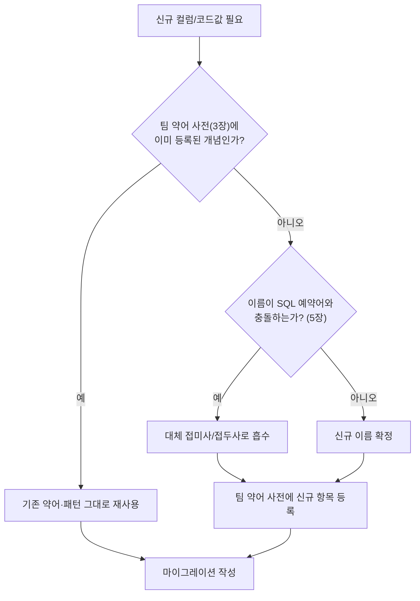

# 데이터베이스 네이밍 표준

웹 프로젝트의 테이블·컬럼·코드값 이름을 일관되게 짓기 위한 범용 규칙이다. 신규 프로젝트에 그대로 채택하거나, 팀 사정에 맞게 값만 조정해서 쓴다.

## 1. 목적 / 적용 범위

- **목적**: 여러 개발자·여러 시기에 걸쳐 작성되는 스키마가 하나의 손으로 쓴 것처럼 보이게 한다. 이름만 보고 타입·의미·검색 키를 추측할 수 있게 한다.
- **적용 범위**: PostgreSQL을 기본 대상으로 하되, MySQL·MariaDB 등 다른 RDBMS에도 대부분 그대로 적용 가능하다. 테이블명, 컬럼명, 인덱스명, 제약조건명, 코드/enum 값, ORM 엔티티의 컬럼 매핑까지 포함한다.
- **적용 대상 파일**: DB 마이그레이션 스크립트, ORM 엔티티(`@Column`, `@Table` 등 어노테이션), API DTO 필드명(가능하면 DB 컬럼명과 1:1 대응), 코드 테이블 마스터 데이터.

## 2. 기본 원칙

| 원칙 | 내용 | MUST/SHOULD |
|------|------|--------------|
| snake_case | 테이블·컬럼·인덱스명은 소문자 + 언더스코어(`_`)로만 구성한다 | MUST |
| 소문자 고정 | 대문자·카멜케이스·파스칼케이스를 식별자에 쓰지 않는다 (따옴표로 감싸야 하는 대소문자 구분 식별자를 만들지 않기 위함) | MUST |
| 시작 문자 | 이름은 반드시 문자로 시작하고 숫자로 시작하지 않는다 | MUST |
| 언더스코어 위치 | 이름 끝에 언더스코어를 붙이지 않고, 언더스코어를 연속으로 두 번 이상 쓰지 않는다 | MUST |
| 길이 제한 | 식별자는 63바이트(PostgreSQL 제한) 이내로 유지하고, 실무적으로는 30자 이내를 권장한다 | SHOULD |
| 테이블명 = 복수형 | 테이블은 여러 행(레코드 집합)을 담으므로 복수형 또는 집합명사를 쓴다 (`users`, `orders`, `staff`) | SHOULD |
| 컬럼명 = 단수형 | 컬럼 하나는 값 하나를 담으므로 단수형을 쓴다 (`user_id`, `order_status`) | SHOULD |
| 일관성 > 취향 | 단수/복수, 축약어 선택 등 여러 방식이 다 defensible 하더라도, **한 프로젝트 안에서는 하나의 규칙만** 쓴다 | MUST |
| 접두사 금지 | `tbl_`, `sp_` 같은 헝가리안 표기·타입 접두사를 테이블명·프로시저명에 붙이지 않는다 | MUST |
| 비즈니스 용어 우선 | 소스 시스템 내부 은어보다 비즈니스 용어를 기준으로 이름 짓는다 | SHOULD |
| 축약 지양 | `cust`(customer), `ord`(order) 같은 임의 축약보다 완전한 단어를 우선한다. 축약이 필요하면 반드시 팀 표준 약어 사전(§3)에 등록된 것만 쓴다 | MUST |
| 예약어 회피 | SQL 예약어를 식별자로 쓰지 않는다 (§5) | MUST |
| 다중 스키마 환경 | 여러 환경(DEV/QA/PROD)에서 같은 DB에 접속하는 경우, **스키마 prefix를 SQL 문 안에 하드코딩하지 않는다.** 커넥션/설정에서 스키마를 주입받는다 (예: PostgreSQL `search_path`, 마이그레이션 툴의 `schemas` 설정) | MUST |

## 3. 표준 약어 사전

프로젝트에서 반복적으로 등장하는 개념은 미리 정한 약어로 통일한다. 아래는 채택 가능한 템플릿이며, 프로젝트 도메인에 맞게 행을 추가/삭제해도 된다. **핵심은 한번 정하면 프로젝트 전체에서 예외 없이 지키는 것**이다.

| 약어 | 전체 의미 | 패턴 | 예시 |
|------|-----------|------|------|
| `TP` | Type(유형) | `{명사}_tp` | `payment_tp`, `job_tp` |
| `CD` | Code(코드) | `{명사}_cd` | `status_cd`, `country_cd` |
| `NM` | Name(명칭) | `{명사}_nm` 또는 `{명사}_nm_{언어}` | `display_nm`, `product_nm_kor` |
| `ID` / `UUID` | 식별자 | `{명사}_id` 또는 `{명사}_uuid` | `user_id`, `order_uuid` |
| `AT` | Timestamp(시각) | `{동작}_at` | `created_at`, `updated_at` |
| `ON` | Date(날짜, 시각 없이 날짜만) | `{동작}_on` | `expired_on`, `published_on` |
| `FLAG` | Boolean(참/거짓) | `{속성}_flag` 또는 `is_/has_` 접두사 | `active_flag`, `is_verified`, `has_attachment` |
| `SEQ` | 순서/시퀀스 | `{명사}_seq` 또는 `display_seq` | `display_seq`, `line_seq` |
| `CNT` | Count(개수) | `{명사}_cnt` | `retry_cnt`, `item_cnt` |
| `AMT` | Amount(금액) | `{명사}_amt` | `total_amt`, `discount_amt` |
| `QTY` | Quantity(수량) | `{명사}_qty` | `order_qty` |
| `DESC` | Description(설명) | `{명사}_desc` | `error_desc` |
| `URL` | 링크 주소 | `{명사}_url` | `callback_url`, `avatar_url` |
| `BY_ID`/`BY_UUID` | 행위자(수행자) | `{동작}_by_id` | `created_by_id`, `approved_by_uuid` |

> 이 표가 팀의 "약어 SSOT(단일 진실 공급원)"가 된다. 신규 약어를 추가할 때는 이 표에 먼저 등록하고 코드에 반영한다. 등록되지 않은 임의 약어(개인 습관, 팀마다 다른 `dt`/`date`/`tm` 혼용 등)는 금지한다.

## 4. 접미사 규약

컬럼 이름의 **끝 부분(접미사)** 만 보고도 타입과 의미를 짐작할 수 있어야 한다.

| 접미사 | 의미 | 권장 DB 타입 | 예시 |
|--------|------|--------------|------|
| `_at` | 특정 시점의 타임스탬프 | `TIMESTAMPTZ` (타임존 포함 권장) | `created_at`, `deleted_at`, `resolved_at` |
| `_on` | 날짜만(시각 불필요) | `DATE` | `due_on`, `billing_on` |
| `_flag` | 참/거짓 값 | `BOOLEAN` | `active_flag`, `secure_flag` |
| `is_`, `has_` (접두사) | 참/거짓 값 (질문형) | `BOOLEAN` | `is_active`, `has_children` |
| `_id`, `_uuid` | 고유 식별자 | `BIGINT`/`INTEGER` 또는 `UUID` | `user_id`, `session_uuid` |
| `_cd` | 코드값(고정된 짧은 값 집합) | `VARCHAR(n)` | `status_cd`, `role_cd` |
| `_nm` | 사람이 읽는 이름/명칭 | `VARCHAR(n)` | `display_nm` |
| `_seq` | 정렬/순서 값 | `INTEGER` | `display_seq` |
| `_tp` | 분류/유형 | `VARCHAR(n)` | `payment_tp` |
| `_by_id`, `_by_uuid` | 행위자 참조(감사 목적) | `BIGINT`/`UUID` (FK) | `created_by_id`, `updated_by_uuid` |
| `_cnt` | 개수 | `INTEGER` | `login_fail_cnt` |
| `_ratio`, `_pct` | 비율/퍼센트 | `NUMERIC` | `discount_pct` |

**Do / Don't**

```sql
-- Do: 접미사가 타입·의미를 명확히 전달
created_at        TIMESTAMPTZ NOT NULL DEFAULT now(),
active_flag       BOOLEAN     NOT NULL DEFAULT true,
order_status_cd   VARCHAR(20) NOT NULL,
approved_by_uuid  UUID        NULL,

-- Don't: 접미사 없이 타입이 이름만으로 짐작 안 됨
created           TIMESTAMPTZ, -- 시각인지 날짜인지 불명확
active            BOOLEAN,     -- flag 표기 없어 boolean 여부 불명확
status            VARCHAR(20), -- 예약어 충돌 위험 (§5)
approver          UUID,        -- FK 대상 컬럼임이 이름에서 드러나지 않음
```

## 5. SQL 예약어 회피 매핑

아래 단어는 여러 RDBMS(PostgreSQL, MySQL, SQL Server, Oracle 등)에서 예약어이거나 예약어에 가깝다. **컬럼명·테이블명·코드값에 그대로 쓰지 않는다.** 꼭 써야 하면 이름 앞뒤에 붙는 접두사/접미사로 흡수해서 예약어 자체가 단독 토큰이 되지 않게 한다.

| 예약어 | 문제 | 대체안 | 예시 |
|--------|------|--------|------|
| `TYPE` | 다수 RDBMS 예약어/타입 시스템 용어와 충돌 | `TP` | `payment_tp` (❌ `payment_type`) |
| `NAME` | 표준/내장 함수와 충돌 소지 | `NM` | `display_nm` (❌ `name`) |
| `ORDER` | `ORDER BY` 절과 충돌 | `SEQ` / `SORT_ORDER` | `display_seq` (❌ `order`) |
| `STATUS` | 일부 방언에서 예약/준예약어 | `STATUS_CD` | `order_status_cd` (❌ `status`) |
| `KEY` | 인덱스/제약조건 키워드와 충돌 | `_KEY` 접미사로 흡수 | `api_key`, `partition_key` (단독 `key` 금지) |
| `VALUE` | 함수/표현식 키워드와 충돌 | `_VALUE` 접미사로 흡수 | `config_value` (❌ `value`) |
| `TIMESTAMP` | 타입명과 동일 | `_AT` 접미사 + `TIMESTAMPTZ` 타입 | `created_at` (❌ `timestamp`) |
| `USER` | 대부분 RDBMS 예약어(`CURRENT_USER` 등) | `_UUID`/`_BY_ID`/`USER_ID` | `created_by_id`, `owner_user_id` (❌ `user`) |
| `COMMENT` | DDL 키워드(`COMMENT ON ...`)와 충돌 | `REMARK` | `remark` (❌ `comment`) |
| `GROUP` | `GROUP BY` 절과 충돌 | `_GROUP_CD`/`_GROUP_ID` | `permission_group_cd` (❌ `group`) |
| `TABLE` | DDL 키워드 | 사용 자체를 피함 | - |
| `COLUMN` | DDL 키워드 | 사용 자체를 피함 | - |
| `LIMIT` | 페이징 절 키워드 | `_LIMIT` 접미사로 흡수 또는 `MAX_`/`CAP_` | `rate_limit` |
| `LEVEL` | 일부 방언 예약어 | 단독 사용 지양, `_LEVEL` 접미사로 흡수 | `access_level` |
| `DATA` | 예약어는 아니나 지나치게 모호 | 구체적 명사로 대체 | `payload`, `body` |

> **작업 습관**: 새 컬럼명을 확정하기 전에 대상 RDBMS의 공식 예약어 목록(예: PostgreSQL은 `SELECT * FROM pg_get_keywords()`)으로 한 번 확인하는 습관을 들인다. 특히 여러 DB 엔진을 오갈 가능성이 있는 프로젝트는 가장 보수적인 목록(교집합이 아니라 합집합) 기준으로 판단한다.

## 6. 코드·enum 값 네이밍 규칙

코드성 컬럼(`_cd`, `_tp`)에 들어가는 **값 자체**의 이름도 컬럼 이름과 동일한 규칙을 따른다.

- MUST: 코드값은 `SCREAMING_SNAKE_CASE`(대문자 + 언더스코어)로 통일한다. 예: `PENDING`, `IN_PROGRESS`, `COMPLETED`.
- MUST: 코드값에도 §5의 예약어 회피가 적용된다. 예: `TYPE_A` 대신 `TP_A`를 쓸 필요는 없지만(값은 문자열 리터럴이라 예약어 충돌이 안 남), 코드값을 담는 **컬럼명**은 반드시 `_cd`/`_tp` 접미사를 쓴다.
- SHOULD: enum류 값 집합은 애플리케이션 코드(TypeScript enum, Java enum 등)와 DB 코드값이 **문자 그대로 1:1 매핑**되게 한다. 매핑 테이블이나 주석에 근거(SSOT)를 남긴다.
- SHOULD: 상태값은 동사가 아니라 상태를 나타내는 형용사/명사로 짓는다 (`APPROVE`가 아니라 `APPROVED`).
- MUST NOT: 코드값에 공백, 하이픈(`-`), 소문자를 섞지 않는다. (`in progress`, `in-progress`, `InProgress` 금지)

```sql
-- Do
order_status_cd VARCHAR(20) NOT NULL CHECK (order_status_cd IN ('PENDING','PAID','SHIPPED','CANCELLED'))

-- Don't
order_status_cd VARCHAR(20) NOT NULL CHECK (order_status_cd IN ('pending','Paid','in-progress'))
```

### 신규 컬럼/코드값 추가 시 결정 절차



## 7. 다국어 컬럼 네이밍 (다국어 지원 프로젝트 선택 적용)

여러 언어로 텍스트를 저장해야 하는 프로젝트는 언어별 컬럼을 분리하거나, 별도 번역 테이블을 둔다. 컬럼 분리 방식을 쓸 경우 아래 접미사를 권장한다.

| 접미사 | 언어 | 예시 |
|--------|------|------|
| `_kor` | 한국어 | `product_nm_kor` |
| `_eng` | 영어 | `product_nm_eng` |
| `_chn` | 중국어 | `product_nm_chn` |
| `_jpn` | 일본어 | `product_nm_jpn` |

- SHOULD: 언어 3종 이상을 지원하거나 언어가 자주 추가/제거되는 도메인이라면, 컬럼 분리 대신 **번역 전용 테이블**(`{엔티티}_translation`, 컬럼 `{엔티티}_id`, `lang_cd`, `nm` 등)을 우선 검토한다. 컬럼 분리 방식은 언어 추가 시마다 스키마 변경(ALTER TABLE)이 필요하다는 단점이 있다.
- MUST: 컬럼 분리 방식을 택했다면, 한 프로젝트 안에서 언어 접미사 집합과 순서(예: kor → eng → chn)를 통일한다.

```sql
-- 컬럼 분리 방식
CREATE TABLE products (
    product_id   BIGINT PRIMARY KEY,
    product_nm_kor VARCHAR(200) NOT NULL,
    product_nm_eng VARCHAR(200),
    product_nm_chn VARCHAR(200)
);

-- 번역 테이블 방식 (언어 확장에 유리)
CREATE TABLE product_translations (
    product_id BIGINT NOT NULL REFERENCES products(product_id),
    lang_cd    VARCHAR(10) NOT NULL,
    product_nm VARCHAR(200) NOT NULL,
    PRIMARY KEY (product_id, lang_cd)
);
```

## 8. 자가 점검 체크리스트

새 테이블/컬럼을 추가하기 전에 아래 항목을 모두 확인한다.

- [ ] 모든 식별자가 소문자 snake_case인가? (대문자, camelCase, PascalCase가 섞이지 않았는가)
- [ ] 테이블명은 복수형/집합명사, 컬럼명은 단수형인가?
- [ ] `tbl_`, `sp_` 같은 타입 접두사를 붙이지 않았는가?
- [ ] §5의 SQL 예약어 목록과 충돌하는 이름이 없는가? (`type`, `name`, `order`, `status`, `key`, `value`, `timestamp`, `user`, `comment`, `group` 단독 사용 여부)
- [ ] 시각 컬럼은 `_at`(TIMESTAMPTZ), 날짜 컬럼은 `_on`(DATE)으로 구분했는가?
- [ ] boolean 컬럼은 `_flag` 또는 `is_/has_` 접두사로 표기했는가?
- [ ] 코드/유형 컬럼은 `_cd`/`_tp` 접미사를 쓰고, 값은 `SCREAMING_SNAKE_CASE`인가?
- [ ] 새로 쓰는 축약어가 팀 약어 사전(§3)에 이미 등록되어 있는가? 없다면 사전에 먼저 등록했는가?
- [ ] 이름 끝에 불필요한 언더스코어나 연속 언더스코어가 없는가?
- [ ] 식별자 길이가 63바이트(PostgreSQL 하드 리밋)를 넘지 않는가?
- [ ] 여러 환경(DEV/QA/PROD)을 쓰는 프로젝트라면, SQL 문에 스키마 prefix를 하드코딩하지 않았는가?
- [ ] (다국어 프로젝트) 언어 접미사 집합·순서가 기존 컬럼들과 일치하는가?
- [ ] ORM 엔티티/DTO 필드명이 DB 컬럼명과 합리적으로 대응되는가? (camelCase ↔ snake_case 자동 매핑 규칙이 팀에 명확히 공유되어 있는가)

## 9. 참고 문헌

- [SQL style guide by Simon Holywell](https://www.sqlstyle.guide/) — 테이블/컬럼 네이밍, 예약어 회피, 접미사 규약(`_id`, `_status`, `_total`, `_num`)의 원조 격 가이드.
- [PostgreSQL Naming Conventions - GeeksforGeeks](https://www.geeksforgeeks.org/postgresql/postgresql-naming-conventions/) — PostgreSQL 식별자 대소문자 폴딩 규칙과 snake_case 채택 이유.
- [Why Snake Case Is the Best Naming Convention for PostgreSQL](https://medium.com/mr-plan-publication/why-snake-case-is-the-best-naming-convention-for-postgresql-776063a57ff3) — unquoted 식별자 소문자 폴딩, `is_`/`has_` boolean 접두사, `created_at`/`updated_at` 관례.
- [How we style our dbt models — dbt Developer Hub](https://docs.getdbt.com/best-practices/how-we-style/1-how-we-style-our-dbt-models) — snake_case, 비즈니스 용어 우선, 축약 지양, `{object}_id` 패턴, 일관성이 방식 선택보다 중요하다는 원칙.
- [SQL Naming Conventions: Tables, Columns, Indexes & More — Simple Talk (Redgate)](https://www.red-gate.com/simple-talk/other/sql-naming-conventions/) — 예약어 충돌 회피, 복수형 테이블명이 예약어 충돌을 줄이는 이유.
