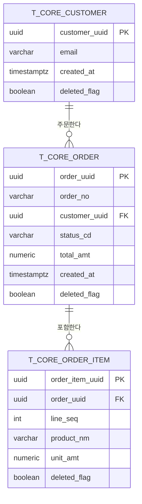

# 테이블·컬럼 설계 표준

이 문서는 웹 프로젝트의 데이터베이스 **테이블 설계**와 **컬럼 설계**에 관한 범용 표준을 정의한다. 특정 프로젝트에 종속되지 않으며, AI 코딩 에이전트(Claude 등)가 신규 테이블·컬럼을 설계할 때 바로 채택할 수 있는 결정 기준과 예시를 제공하는 것이 목적이다.

컬럼명 약어·예약어 회피의 상세 규칙은 별도 문서 `01-database-naming-rules.md`(네이밍 표준)를 SSOT로 하며, 이 문서에서는 테이블·컬럼 설계에 필요한 만큼만 요약해 다룬다.

## 적용 범위

- PostgreSQL(또는 호환 RDBMS, 예: Aurora PostgreSQL)을 전제로 하되, 다른 RDBMS에도 대부분 그대로 적용 가능하다.
- 신규 테이블 생성, 기존 테이블에 컬럼 추가, 마이그레이션 작성 시 이 문서를 기준으로 판단한다.
- 이 문서의 목록형 예시(접두사 체계 등)는 **템플릿**이다. 프로젝트 도메인에 맞게 조정하되, 조정한 결과는 프로젝트 자체 문서(예: `CLAUDE.md`, `AGENTS.md`)에 SSOT로 고정해야 한다.

---

## 1. [테이블] 네이밍 규칙

### 1.1 기본 표기 규칙

| 규칙 | 내용 |
|------|------|
| 대소문자 | `snake_case`, 전부 소문자 |
| 단수/복수 | **단수형 권장** (`t_core_order`, `order_item`) — 접두사 체계와 결합 시 일관성 유지가 쉽다 |
| 구분자 | 단어 사이 `_` |
| 범용 접두사 금지 | `tbl_`, `tb_` 같은 의미 없는 범용 접두사는 사용하지 않는다(테이블임은 자명하므로 정보량이 0) |
| 예약어 회피 | 테이블명에 RDBMS 예약어(`order`, `group`, `user` 등)를 단독으로 쓰지 않는다 |

> 단수/복수 논쟁은 커뮤니티마다 결론이 다르다(Rails류 ORM은 복수 선호, 다수 최신 스타일 가이드는 단수 선호). **핵심은 "선택 후 문서화하고 프로젝트 전체에서 일관되게 지키는 것"**이다. 이 표준은 목적 기반 접두사와 결합했을 때 가독성이 좋은 **단수형**을 기본값으로 채택한다.

### 1.2 목적 기반 접두사 체계

테이블이 20~30개를 넘어가는 프로젝트에서는 접두사 없이 알파벳 순으로만 정렬된 테이블 목록이 빠르게 탐색 불가능해진다. **테이블을 도메인/기능 목적 단위로 그룹핑하는 접두사**를 프로젝트 초기에 정의하고 고정한다.

**예시 템플릿(조정 가능)** — 실제 사용 시 프로젝트 도메인에 맞게 접두사 집합을 새로 정의할 것:

| 접두사 | 목적 | 예시 |
|--------|------|------|
| `t_core_` | 핵심 비즈니스 엔티티 | `t_core_order`, `t_core_customer` |
| `t_sys_` | 시스템/감사 로그 | `t_sys_api_audit_log` |
| `t_stat_` | 통계/집계(파생 데이터) | `t_stat_order_daily` |
| `t_batch_` | 배치 작업 정의/이력 | `t_batch_job`, `t_batch_run` |
| `t_auth_` | 인증/보안 | `t_auth_login_history` |
| `t_noti_` | 알림/메일 발송 이력 | `t_noti_alert`, `t_noti_alert_log` |
| `t_if_` | 외부 시스템 연계(인터페이스) | `t_if_service_log` |
| `t_quality_` | 데이터 품질 규칙/이력 | `t_quality_violation_sample` |

### 1.3 접두사 정의 가이드 (신규 프로젝트 시작 시)

1. 프로젝트의 주요 도메인 경계를 먼저 나열한다 (예: 주문, 결제, 회원, 알림, 배치, 감사).
2. 각 경계에 3~6글자의 짧은 접두사를 부여한다. **의미가 겹치지 않게** 한다.
3. "기타" 성격의 접두사(`t_core_` 등 핵심 비즈니스용)는 반드시 하나 두어 도메인 미확정 테이블의 임시 안착지로 쓰되, 누적되면 주기적으로 재분류한다.
4. 정의한 접두사 집합은 프로젝트 루트 가이드 문서(`CLAUDE.md`/`AGENTS.md` 등)에 표로 고정하고, 새 접두사 추가 시 그 표를 갱신한다 — 접두사 목록의 SSOT는 코드가 아니라 문서다.
5. 한 테이블에 두 개 이상의 접두사가 동시에 어울리면, 더 좁은(구체적인) 도메인을 우선한다.

### 1.4 Do / Don't

```sql
-- Do
CREATE TABLE t_core_order (...);
CREATE TABLE t_noti_alert_log (...);

-- Don't — 의미 없는 범용 접두사
CREATE TABLE tbl_order (...);

-- Don't — 접두사 없이 알파벳 순 탐색 불가능한 대형 스키마
CREATE TABLE order_2 (...);   -- 목적 불명
CREATE TABLE orders_new (...); -- 임시 이름이 영구화
```

---

## 2. [테이블] 표준 감사 컬럼 세트 + soft-delete 규약

### 2.1 표준 감사 컬럼 (모든 테이블 MUST)

| 컬럼 | 타입 | 필수 | 설명 |
|------|------|------|------|
| `created_at` | `TIMESTAMPTZ` | MUST | 레코드 생성 시각, `DEFAULT now()` |
| `updated_at` | `TIMESTAMPTZ` | MUST | 마지막 수정 시각, 애플리케이션 또는 트리거로 갱신 |
| `created_by` | `UUID` | SHOULD | 생성한 사용자/주체 식별자 (시스템 배치는 NULL 허용 또는 시스템 계정 UUID) |
| `updated_by` | `UUID` | SHOULD | 마지막 수정한 사용자/주체 식별자 |
| `deleted_flag` | `BOOLEAN` | MUST (soft-delete 대상 테이블) | 논리 삭제 플래그, `DEFAULT false` |

> 순수 로그/이력 테이블(`t_sys_*`, `t_stat_*` 등 append-only 성격)은 `updated_at`/`deleted_flag`가 불필요할 수 있다 — 이 경우 예외를 명시적으로 문서화한다.

### 2.2 Soft-delete 규약

- **물리 삭제(`DELETE`) 대신 논리 삭제를 기본으로 한다.** 감사 추적, 참조 무결성 보존, 복구 가능성을 위해서다.
- 삭제 시 `deleted_flag = true` 로 설정하고 **동시에 `updated_at` 을 갱신**한다. 둘 중 하나만 하면 삭제 시점 추적이 깨진다.
- `deleted_at TIMESTAMPTZ` 컬럼을 별도로 둘지는 프로젝트 선택이다. 삭제 시점을 `updated_at`과 분리해 정밀 추적해야 하면 추가한다(예: 복구 정책이 "삭제 후 N일 이내"인 경우).
- 조회 쿼리는 **기본적으로 `WHERE deleted_flag = false` 를 강제**한다. ORM 레벨 글로벌 필터(Hibernate `@Where`, Prisma middleware 등) 사용을 권장하며, 실수로 삭제된 행이 노출되는 사고를 코드 리뷰가 아닌 프레임워크 레벨에서 차단한다.
- Soft-delete와 유니크 제약은 충돌한다 — 상세는 §4.2(부분 유니크 인덱스) 참조.
- 물리 삭제가 반드시 필요한 경우(GDPR 등 법적 삭제 요구, 저장 비용)는 별도 배치로 "soft-delete 후 일정 기간 경과 시 physical purge"를 명시적으로 설계한다. 즉시 물리 삭제를 기본 경로로 두지 않는다.

### 2.3 Do / Don't

```sql
-- Do — soft delete
UPDATE t_core_order
SET deleted_flag = true, updated_at = now(), updated_by = :actor_uuid
WHERE order_uuid = :id AND deleted_flag = false;

-- Don't — 물리 삭제를 기본 경로로 사용
DELETE FROM t_core_order WHERE order_uuid = :id;

-- Don't — updated_at 갱신 누락
UPDATE t_core_order SET deleted_flag = true WHERE order_uuid = :id;
```

---

## 3. [테이블] 기본키(PK) 전략

### 3.1 UUID vs BIGINT 트레이드오프

| 항목 | `BIGINT` (auto-increment / identity) | `UUID v4` (랜덤) | `UUID v7` (시간 정렬) |
|------|---------------------------------------|-------------------|--------------------------|
| 저장 크기 | 8 byte | 16 byte (2배) | 16 byte (2배) |
| B-tree 인덱스 지역성 | 우수 — 항상 끝에 순차 삽입 | 나쁨 — 무작위 페이지 삽입 → 페이지 분할·캐시 미스 증가 | 우수 — 시간순 정렬이라 순차 삽입에 가까움 |
| 복제(WAL) 부하 | 낮음 | 높음 — 페이지 분산 삽입이 WAL 증폭 유발 | 낮음~중간 |
| 분산 생성(다중 노드/오프라인 생성) | 불가 (중앙 시퀀스 필요) | 가능 | 가능 |
| 시스템 간 병합(마이그레이션, 다중 DB 통합) | 충돌 위험 (재채번 필요) | 충돌 없음 | 충돌 없음 |
| 추측 가능성(보안) | 예측 가능 (URL에 노출 시 IDOR 위험) | 예측 불가 | 순서는 추정 가능하나 완전 랜덤은 아님 |
| 가독성(로그·디버깅) | 좋음 (짧은 숫자) | 나쁨 | 나쁨 |

**권장 기본값**: 외부에 노출되는 리소스 식별자(API 응답의 PK, URL 경로 등)나 다중 시스템 간 연계가 있는 테이블은 **UUID**(가능하면 v7, 미지원 환경은 v4)를 사용한다. 단일 서비스 내부에서만 쓰이고 대량 쓰기 성능이 중요한 로그/통계성 테이블은 `BIGINT GENERATED ALWAYS AS IDENTITY` 를 고려한다. 두 경우 모두 **프로젝트 전체에서 일관된 기준으로 통일**해야 하며, 테이블마다 다른 전략을 임의로 섞지 않는다.

### 3.2 컬럼명 규칙

- UUID PK 컬럼명: `{엔티티}_uuid` (예: `order_uuid`) — 범용 `id` 보다 조인 시 컬럼 출처가 명확해진다.
- BIGINT PK 컬럼명: `{엔티티}_id` 또는 프로젝트 컨벤션에 따라 `id` 단독 허용.
- PK 컬럼명 접미사는 프로젝트 전체에서 하나로 통일한다(`_uuid`/`_id` 혼용 금지).

```sql
-- Do
order_uuid UUID PRIMARY KEY DEFAULT gen_random_uuid(),

-- Don't — 접미사 불일치 (같은 프로젝트 내 테이블마다 제각각)
id UUID PRIMARY KEY,          -- 다른 테이블은 order_uuid 사용 중
```

---

## 4. [컬럼] 네이밍 · nullability · 기본값

### 4.1 약어·접미사 요약

상세 근거와 전체 예약어 목록은 `01-database-naming-rules.md` 를 참조한다. 여기서는 테이블/컬럼 설계 시 즉시 쓰는 핵심만 요약한다.

| 약어 | 의미 | 패턴 | 예시 |
|------|------|------|------|
| `TP` | Type (예약어 `TYPE` 대체) | `{명사}_tp` | `batch_job_tp` |
| `CD` | Code | `{명사}_cd` | `status_cd` |
| `NM` | Name (예약어 `NAME` 대체) | `{명사}_nm` | `display_nm` |
| `UUID` | 식별자 | `{명사}_uuid` | `order_uuid` |
| `AT` | 시각 (예약어 `TIMESTAMP` 대체) | `{동작}_at` | `created_at` |
| `FLAG` | 불리언 | `{속성}_flag` | `active_flag` |
| `SEQ` | 순서 (예약어 `ORDER` 대체) | `{명사}_seq` | `display_seq` |

**PostgreSQL 예약어 회피 필수 목록** (컬럼명에 단독 사용 금지 → 대체):

| 예약어 | 대체 |
|--------|------|
| `type` | `_tp` |
| `name` | `_nm` |
| `order` | `_seq` / `sort_order` |
| `status` | `status_cd` |
| `key` | `_key` (접미사로) |
| `value` | `_value` (접미사로) |
| `user` | `_uuid` / `_by_uuid` |
| `group` | `_group_cd` / `_group_uuid` |

### 4.2 Nullability

| 원칙 | 내용 |
|------|------|
| MUST | 업무상 값이 항상 있어야 하는 컬럼은 `NOT NULL` 로 선언한다. "일단 NULL 허용"을 기본값으로 삼지 않는다 |
| MUST | FK 컬럼의 NULL 허용 여부는 관계의 필수/선택 여부를 그대로 반영한다 (선택 관계만 NULL 허용) |
| SHOULD | 불리언 컬럼(`_flag`)은 NULL을 허용하지 않는다 — 3치 논리(NULL/true/false)는 조건문 버그의 흔한 원인이므로 `DEFAULT false` + `NOT NULL` 조합을 기본으로 한다 |
| SHOULD | 문자열 컬럼에 빈 문자열(`''`)과 NULL을 동시에 "값 없음"으로 혼용하지 않는다 — 하나만 선택 |

### 4.3 기본값

| 컬럼 유형 | 기본값 권장 |
|-----------|-------------|
| `created_at` | `DEFAULT now()` |
| `deleted_flag` | `DEFAULT false` |
| 상태 코드(`status_cd`) | 초기 상태값을 명시적 `DEFAULT` 로 지정 (예: `DEFAULT 'DRAFT'`) — 애플리케이션 코드에만 의존하면 직접 INSERT 시 상태 불일치 발생 |
| 카운터/시퀀스 | `DEFAULT 0` |
| JSONB | 빈 객체가 유효하면 `DEFAULT '{}'::jsonb`, 아니면 `NOT NULL` 강제하지 않고 NULL 허용 |

---

## 5. [컬럼] 데이터 타입 매핑

| 의미 | 권장 타입 | 접미사 | 비고 |
|------|-----------|--------|------|
| 이벤트 발생 시각 (생성/수정/삭제 등) | `TIMESTAMPTZ` | `_at` | `TIMESTAMP`(timezone 없음)는 사용 금지 — UTC 기준 내부 저장, 조회 시 클라이언트 타임존으로 변환 |
| 순수 날짜(생일, 마감일 등 시각 무관) | `DATE` | `_dt` | 시각 정보가 필요 없는 값에 `TIMESTAMPTZ` 를 쓰면 타임존 변환 버그 유발 |
| 불리언 | `BOOLEAN` | `_flag` | NULL 비허용 원칙(§4.2) |
| 식별자(PK/FK) | `UUID` 또는 `BIGINT` | `_uuid` / `_id` | §3.1 트레이드오프 참조, 프로젝트 내 통일 |
| 코드(고정 집합의 짧은 값) | `VARCHAR(n)` | `_cd` | 네이티브 `ENUM` 타입은 값 추가 시 스키마 변경이 번거로워 지양 — 코드값 + 참조 테이블(lookup table) 조합을 권장 |
| 명칭/텍스트(길이 제한 있음) | `VARCHAR(n)` | `_nm` | n은 실제 업무 제약에 맞게 산정 |
| 긴 텍스트(길이 제한 없음) | `TEXT` | `_remark` / `_desc` | 코멘트류는 예약어 회피 위해 `remark` 사용 |
| 반정형/가변 구조 데이터 | `JSONB` | (명사 그대로) | `JSON` 대신 `JSONB` — 저장 시 파싱되어 조회 성능이 좋고 GIN 인덱스로 검색 가능 |
| 금액·정밀 소수(반올림 오차 허용 불가) | `NUMERIC(p,s)` | `_amt` | 부동소수점(`FLOAT`/`DOUBLE PRECISION`)은 금액에 사용 금지 |
| 정수 카운트 | `INTEGER` / `BIGINT` | `_cnt` | 값 상한이 21억을 넘을 가능성이 있으면 `BIGINT` |
| 과학적 근사치(반올림 오차 허용) | `DOUBLE PRECISION` | 자유 | 금액·수량 등 정확도가 필요한 값에는 사용하지 않는다 |
| 열거형이지만 코드표 관리가 과함(2~5개 고정값) | `VARCHAR` + `CHECK` 제약 | `_cd` | 네이티브 `ENUM`보다 마이그레이션이 쉽고, 참조 테이블보다 오버헤드가 적다 |

### 5.1 Do / Don't

```sql
-- Do
created_at TIMESTAMPTZ NOT NULL DEFAULT now(),
amount NUMERIC(15,2) NOT NULL,
extra_data JSONB,

-- Don't — timezone 없는 timestamp
created_at TIMESTAMP NOT NULL DEFAULT now(),

-- Don't — 금액에 부동소수점
amount DOUBLE PRECISION NOT NULL,

-- Don't — 검색/인덱싱이 필요한 반정형 데이터에 JSON(비바이너리)
extra_data JSON,
```

---

## 6. [컬럼] 업무 유니크키 · 인덱스 기본

### 6.1 PK와 업무 유니크키(Business Unique Key)는 분리한다

- PK(`_uuid`/`_id`)는 **대체키(surrogate key)** 로, 업무 의미를 갖지 않는다.
- 업무상 유일해야 하는 값(주문번호, 사원번호, 이메일 등)은 **별도의 UNIQUE 제약**으로 표현한다.
- 업무 유니크키를 PK로 바로 쓰지 않는 이유: 업무 규칙이 바뀌어 유일성이 깨질 경우(예: 이메일 재사용 정책 변경) PK 변경은 전체 FK 연쇄 변경을 요구하지만, 대체키 + 별도 UNIQUE 제약은 제약만 조정하면 된다.

### 6.2 Soft-delete와 유니크 제약의 충돌 — 부분 유니크 인덱스

Soft-delete 레코드가 유니크 제약에 남아있으면, 삭제된 값과 같은 값으로 재등록할 때 제약 위반이 발생한다. **부분 유니크 인덱스(partial unique index)** 로 `deleted_flag = false` 인 행에만 유니크를 강제한다.

```sql
-- 삭제되지 않은 행에서만 이메일 유일성 보장
CREATE UNIQUE INDEX uidx_user_email
    ON t_core_user (email)
    WHERE deleted_flag = false;
```

### 6.3 복합 유니크키

여러 컬럼 조합이 업무 유니크키인 경우(예: 스키마 내 필드 코드 유일성) 동일하게 부분 유니크 인덱스로 표현한다.

```sql
CREATE UNIQUE INDEX uidx_order_item_order_seq
    ON t_core_order_item (order_uuid, line_seq)
    WHERE deleted_flag = false;
```

### 6.4 인덱스 기본 원칙

| 원칙 | 내용 |
|------|------|
| MUST | FK 컬럼에는 **명시적으로 인덱스를 생성**한다 — PostgreSQL은 FK 생성 시 인덱스를 자동으로 만들지 않는다 |
| MUST | 인덱스명은 접두사로 종류를 구분한다: `idx_`(일반), `uidx_`(유니크) |
| SHOULD | `WHERE` 절에 자주 등장하는 컬럼(특히 `status_cd`, `deleted_flag`)은 조합 인덱스 후보로 검토한다 |
| SHOULD | `JSONB` 컬럼 내부 키로 검색이 필요하면 GIN 인덱스를 추가한다 (`CREATE INDEX ... USING GIN (column)`) |
| SHOULD NOT | 카디널리티가 매우 낮은 단일 컬럼(예: `deleted_flag` 단독)에는 단독 인덱스를 만들지 않는다 — 복합 인덱스의 일부로 포함 |

---

## 7. 예시: 표준 테이블 DDL + ERD

### 7.1 표준 테이블 DDL

감사 컬럼, soft-delete, UUID PK, 업무 유니크키(부분 유니크 인덱스)를 모두 포함한 예시.

```sql
CREATE TABLE t_core_order (
    order_uuid      UUID PRIMARY KEY DEFAULT gen_random_uuid(),
    order_no        VARCHAR(30)  NOT NULL,          -- 업무 유니크키 (부분 유니크 인덱스로 보장)
    customer_uuid   UUID         NOT NULL REFERENCES t_core_customer(customer_uuid),
    status_cd       VARCHAR(20)  NOT NULL DEFAULT 'DRAFT',
    total_amt       NUMERIC(15,2) NOT NULL DEFAULT 0,
    extra_data      JSONB,
    active_flag     BOOLEAN      NOT NULL DEFAULT true,
    deleted_flag    BOOLEAN      NOT NULL DEFAULT false,
    created_at      TIMESTAMPTZ  NOT NULL DEFAULT now(),
    created_by      UUID,
    updated_at      TIMESTAMPTZ  NOT NULL DEFAULT now(),
    updated_by      UUID
);

-- 업무 유니크키: 삭제되지 않은 행에서만 order_no 유일
CREATE UNIQUE INDEX uidx_order_order_no
    ON t_core_order (order_no)
    WHERE deleted_flag = false;

-- FK 컬럼 명시적 인덱스
CREATE INDEX idx_order_customer_uuid
    ON t_core_order (customer_uuid);

CREATE TABLE t_core_order_item (
    order_item_uuid UUID PRIMARY KEY DEFAULT gen_random_uuid(),
    order_uuid      UUID         NOT NULL REFERENCES t_core_order(order_uuid),
    line_seq        INTEGER      NOT NULL,
    product_nm      VARCHAR(200) NOT NULL,
    qty             INTEGER      NOT NULL DEFAULT 1,
    unit_amt        NUMERIC(15,2) NOT NULL,
    deleted_flag    BOOLEAN      NOT NULL DEFAULT false,
    created_at      TIMESTAMPTZ  NOT NULL DEFAULT now(),
    updated_at      TIMESTAMPTZ  NOT NULL DEFAULT now()
);

CREATE UNIQUE INDEX uidx_order_item_order_seq
    ON t_core_order_item (order_uuid, line_seq)
    WHERE deleted_flag = false;

CREATE INDEX idx_order_item_order_uuid
    ON t_core_order_item (order_uuid);
```

### 7.2 ERD



---

## 8. 자가 점검 체크리스트

새 테이블/컬럼을 추가하기 전 아래 항목을 모두 확인한다.

### 테이블

- [ ] 테이블명이 프로젝트에 정의된 목적 기반 접두사 체계를 따르는가?
- [ ] `tbl_` 등 의미 없는 범용 접두사를 사용하지 않았는가?
- [ ] 단수/복수 규칙이 프로젝트 전체와 일관되는가?
- [ ] 표준 감사 컬럼(`created_at`, `updated_at`, `deleted_flag` 등)을 포함했는가? (append-only 로그 테이블은 예외 사유를 문서화했는가?)
- [ ] PK 전략(UUID vs BIGINT)이 프로젝트 기준과 일치하는가?
- [ ] PK 컬럼명 접미사(`_uuid`/`_id`)가 프로젝트 전체와 통일되어 있는가?

### 컬럼

- [ ] 컬럼명이 RDBMS 예약어를 단독으로 사용하지 않는가? (§4.1 대체 표 확인)
- [ ] 업무상 필수 값인 컬럼에 `NOT NULL` 을 선언했는가?
- [ ] 불리언 컬럼이 `NOT NULL DEFAULT false/true` 로 선언되어 3치 논리를 피했는가?
- [ ] 시각 컬럼이 `TIMESTAMPTZ` 인가? (`TIMESTAMP` 사용 금지)
- [ ] 금액/정밀 수치 컬럼이 `NUMERIC` 인가? (`FLOAT`/`DOUBLE PRECISION` 사용 금지)
- [ ] 반정형 데이터가 `JSONB` 인가? (`JSON` 사용 금지)
- [ ] 코드성 컬럼에 접미사 `_cd`, 명칭성 컬럼에 `_nm` 을 붙였는가?

### 유니크키 · 인덱스

- [ ] 업무 유니크키가 PK와 분리되어 별도 제약으로 표현되었는가?
- [ ] Soft-delete 테이블의 유니크 제약이 부분 유니크 인덱스(`WHERE deleted_flag = false`)로 되어 있는가?
- [ ] 모든 FK 컬럼에 명시적 인덱스가 생성되었는가?
- [ ] 인덱스명이 `idx_`/`uidx_` 접두사 규칙을 따르는가?

---

## 참고 문헌

- [Database Naming Standards in SQL: Best Practices for Tables and Columns](https://www.devart.com/blog/sql-database-naming-standards.html) — 테이블 접두사·네이밍 일반 원칙
- [SQL Naming Conventions (2026 Tutorial & Examples)](https://brainstation.io/learn/sql/naming-conventions) — 단수/복수, 접두사 논쟁 정리
- [Database, Table, and Column Naming Conventions — Baeldung on SQL](https://www.baeldung.com/sql/database-table-column-naming-conventions) — 컬럼 네이밍 표준
- [Essential Audit Fields to Include in Your Database Tables](https://dev.to/yujin/essential-audit-fields-to-include-in-your-database-tables-3i7e) — 표준 감사 컬럼 세트
- [Change tracking and soft delete: audit trails without the boilerplate](https://dev.to/davidlastrucci/change-tracking-and-soft-delete-audit-trails-without-the-boilerplate-57oc) — soft-delete와 유니크 제약 충돌 및 해법
- [How to Implement Soft Deletes in MySQL](https://oneuptime.com/blog/post/2026-03-31-mysql-soft-deletes/view) — soft-delete 구현 패턴
- [PostgreSQL Primary Key Dilemma: UUID vs. BIGINT](https://medium.com/@sjksingh/postgresql-primary-key-dilemma-uuid-vs-bigint-52008685b744) — UUID/BIGINT 트레이드오프
- [UUIDs vs Serial for Primary Keys - what's the right choice?](https://pganalyze.com/blog/5mins-postgres-uuid-vs-serial-primary-keys) — 인덱스 지역성·WAL 증폭 분석
- [Avoid UUID Version 4 Primary Keys (for Postgres)](https://andyatkinson.com/avoid-uuid-version-4-primary-keys) — UUID v4의 성능 문제와 v7 대안
- [Best Practices for Picking PostgreSQL Data Types](https://www.tigerdata.com/blog/best-practices-for-picking-postgresql-data-types) — TIMESTAMPTZ/JSONB/NUMERIC 권장 근거
- [PostgreSQL: Documentation — 8.14. JSON Types](https://www.postgresql.org/docs/current/datatype-json.html) — JSONB 공식 문서
- [Don't Do This — PostgreSQL wiki](https://wiki.postgresql.org/wiki/Don't_Do_This) — 안티패턴(TIMESTAMP without timezone, char(n) 등) 공식 정리
- 사내 참고 기반: COSMAX-CM-DATAHUB `CLAUDE.md` § 테이블 접두사 규칙 / DB 네이밍 약어 표준 (프로젝트 종속 요소를 제거하고 범용 패턴으로 재구성)
