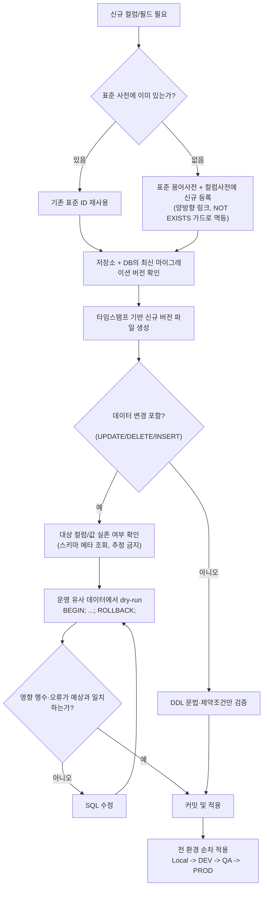

# 데이터 관리 규칙

## 목적

이 문서는 웹 프로젝트에서 데이터베이스 스키마 진화(마이그레이션), 시드/참조 데이터 관리, 표준 용어 거버넌스, 시크릿·PII 취급을 다루는 **범용 표준**이다. 특정 프레임워크에 종속되지 않으며, AI 코딩 에이전트(Claude 등)와 인간 개발자가 동일하게 따를 수 있는 규칙 집합을 제공한다.

이 문서의 예시는 Flyway(SQL 파일 기반 마이그레이션 도구)와 PostgreSQL EAV(속성-값) 패턴을 기준으로 작성했지만, 원칙 자체는 Liquibase, Prisma Migrate, Alembic(Django/SQLAlchemy), Rails ActiveRecord Migrations 등 어떤 마이그레이션 도구·어떤 RDBMS 에도 동일하게 적용된다.

## 적용 범위

- 데이터베이스 스키마 변경(DDL): 테이블/컬럼/인덱스/제약조건 생성·변경·삭제
- 참조 데이터·시드 데이터(DML): 코드값, 마스터 데이터, 초기 설정값
- 엔티티-속성-값(EAV) 구조를 사용하는 프로젝트의 키 설계
- 컬럼/필드 명명을 통제하는 표준 용어 사전이 있는 프로젝트
- 마이그레이션·문서·로그에 노출될 수 있는 시크릿·개인정보(PII)

이 문서는 "MUST(필수)" / "SHOULD(권장)" 표기로 규칙의 강제 수준을 구분한다. MUST 는 위반 시 배포를 막아야 하는 규칙, SHOULD 는 예외가 있을 수 있으나 기본값으로 따라야 하는 규칙이다.

---

## 1. 스키마 진화(마이그레이션) 원칙

### 1.1 버전 관리(Versioned Migration)

- **MUST**: 모든 스키마 변경은 순서가 보장되는 버전 파일로 관리한다. 파일명에 정렬 가능한 버전 식별자를 포함한다.
- **SHOULD**: 버전 식별자는 날짜만이 아니라 **초 단위 이하 타임스탬프**를 포함해 같은 날 여러 명이 작업해도 충돌하지 않게 한다.

  ```text
  V{YYYYMMDD}_{HHMMSSssssss}__{설명}.sql
  예: V20260711_143527849312__add_user_email_verified_flag.sql
  ```

- **MUST**: 마이그레이션 파일을 새로 만들기 **전에** 반드시 다음 두 가지를 확인한다.
  1. 저장소에 존재하는 최신 버전 파일 목록 확인 (`ls | sort | tail`)
  2. 실제 DB(또는 마이그레이션 도구의 이력 테이블)에 적용된 최신 버전 확인
  3. 새로 만들 버전이 위 두 값보다 **확실히 크다는 것**을 확인 후 생성한다.

  이 확인을 건너뛰면 동시 작업 중 버전 충돌이 발생한다. AI 에이전트가 마이그레이션을 생성할 때는 이 확인 절차를 스킵하지 않는다.

### 1.2 Forward-Only(순방향 전용)

- **MUST**: 이미 적용된 마이그레이션은 절대 수정하지 않는다. 잘못된 내용을 고칠 때도 **새 버전 파일**로 되돌리거나 정정한다(roll-forward).
- **MUST**: 롤백이 필요하면 "역방향 마이그레이션"을 새 버전으로 추가한다. 파일을 지우거나 편집해서 되돌리지 않는다.

### 1.3 불변성(Immutability)과 체크섬

- 대부분의 마이그레이션 도구(Flyway 등)는 적용된 파일의 체크섬(CRC32/SHA 등)을 기록한다. 이미 적용된 파일의 내용이 바뀌면 다음 실행에서 체크섬 불일치 오류가 발생해 배포가 중단된다. 이는 사고를 막는 안전장치이지, 우회 대상이 아니다.
- **MUST**: 적용된 파일을 편집해야 하는 상황(오타·주석 수정 등 사소한 변경 포함)이 생기면, 편집 전 반드시 전 환경(Local/DEV/QA/PROD 등)의 마이그레이션 이력 테이블을 확인해 **이미 적용된 환경이 있는지** 확인한다. 하나라도 적용된 환경이 있으면 편집이 아니라 새 버전 파일로 처리한다.
- **SHOULD**: 도구가 `repair`/`validate-on-migrate` 같은 자동 복구 옵션을 제공하더라도, 팀 표준은 "편집 금지 + 새 버전 추가"를 기본으로 하고 자동 복구는 로컬 개발 환경에서의 예외적 편의 기능으로만 사용한다.

### 1.4 스키마 이식성 — 환경별 접두사 하드코딩 금지

- **MUST**: 마이그레이션 SQL 본문에 환경별 스키마명(예: `prod.users`, `myapp_qa.orders`)을 하드코딩하지 않는다. 대부분의 마이그레이션 프레임워크는 실행 시점에 대상 스키마를 주입하는 설정을 제공한다(예: Flyway `spring.flyway.schemas`, 접속 커넥션의 `search_path`). SQL 본문은 스키마 없이 테이블명만 참조한다.
- **이유**: 스키마명을 SQL에 박아 넣으면 동일 파일이 환경마다 다르게 동작하거나, 환경 이름이 바뀔 때 전체 마이그레이션을 다시 써야 한다.
- **점검 대상**: `FROM`/`JOIN`/`WHERE`/`INSERT INTO`/`UPDATE` 절뿐 아니라 `DO $$ ... $$` 같은 동적 블록 내부까지 전수 검사한다.

### 1.5 마이그레이션과 시드의 분리

- **SHOULD**: 구조 변경(DDL)과 데이터 적재(DML/시드)를 논리적으로 구분한다. 두 작업을 같은 파일에 함께 넣어도 무방하지만(특히 신규 컬럼 + 기본값 백필), 대량 운영 데이터에 의존하는 백필은 별도 파일로 분리해 실패 시 영향 범위를 좁힌다.
- 참조 데이터(코드값, 마스터 데이터)는 **반드시 멱등하게** 작성한다(§3).

---

## 2. 마이그레이션 작성 체크리스트

새 마이그레이션을 작성하기 전/후 아래 항목을 모두 통과해야 한다.

- [ ] 저장소의 최신 마이그레이션 버전을 확인했는가?
- [ ] DB에 실제 적용된 최신 버전을 확인했는가? (가능한 경우)
- [ ] 새 버전 식별자가 기존 최댓값보다 명확히 큰가?
- [ ] 파일명 형식이 프로젝트 규약과 정확히 일치하는가? (구분자·설명 포함)
- [ ] SQL 본문에 환경별 스키마 접두사가 하드코딩되어 있지 않은가?
- [ ] `UPDATE`/`DELETE`/`INSERT` 가 참조하는 테이블·컬럼·값이 **실제로 존재**하는가? — 추정 금지. `information_schema.columns`, ORM 엔티티 정의, 또는 스키마 메타데이터로 반드시 확인한다.
- [ ] 데이터에 영향을 주는 마이그레이션(UPDATE/DELETE)을, 운영과 유사한 데이터셋에서 `BEGIN; ... ROLLBACK;` 로 **dry-run** 하여 영향 행수와 오류 유무를 사전 확인했는가?
- [ ] 시드/참조 데이터는 재실행해도 안전한 멱등 구조인가? (§3)
- [ ] 신규 컬럼/필드가 표준 용어·컬럼 사전 절차를 따랐는가? (§5, 해당 프로젝트에 사전이 있는 경우)
- [ ] 시크릿·PII 평문이 SQL·주석·커밋 메시지에 포함되어 있지 않은가? (§7)
- [ ] 물리 삭제(`DELETE FROM ... WHERE`) 대신 soft-delete 정책을 따랐는가, 또는 물리 삭제가 의도적으로 필요한 근거가 명확한가? (§6)

### Do / Don't

| 상황 | Do | Don't |
|------|----|-------|
| 컬럼 추가 | 표준 사전 검색 → 재사용 또는 신규 등록 후 추가 | 임의 이름으로 즉시 컬럼 추가 |
| 버전 파일명 | 목록 정렬 명령으로 최신 버전 확인 후 명확히 큰 값 사용 | "대충 다음 번호"로 추측해서 생성 |
| 스키마 참조 | `FROM users` (스키마는 커넥션/설정이 주입) | `FROM prod.users` (하드코딩) |
| 운영 데이터 UPDATE | `BEGIN; UPDATE ...; ROLLBACK;` 으로 dry-run 후 적용 | 운영에 바로 `UPDATE` 실행 |
| 이미 적용된 파일 오류 발견 | 새 버전 파일로 정정(roll-forward) | 기존 파일을 열어 편집 |
| 참조 데이터 삽입 | `WHERE NOT EXISTS (...)` 가드 또는 `UPSERT` | 조건 없는 `INSERT` |

---

## 3. 멱등 시드 / 데이터 마이그레이션 패턴

시드·참조 데이터는 **몇 번을 재실행해도 최종 상태가 동일**해야 한다. 처음 실행 시 삽입되고, 두 번째 실행부터는 아무 일도 일어나지 않아야 한다(no-op).

### 3.1 NOT EXISTS 가드 패턴

```sql
INSERT INTO code_master (code_id, code_nm, display_seq)
SELECT 'STATUS_ACTIVE', '활성', 1
WHERE NOT EXISTS (
    SELECT 1 FROM code_master WHERE code_id = 'STATUS_ACTIVE'
);
```

### 3.2 UPSERT 패턴 (ON CONFLICT)

```sql
INSERT INTO role_master (role_id, role_nm)
VALUES
    ('ADMIN', '관리자'),
    ('EDITOR', '편집자')
ON CONFLICT (role_id) DO UPDATE
SET role_nm = EXCLUDED.role_nm;
```

### 3.3 데이터 조건부(WHERE) 수렴 패턴

이미 특정 형태로 정리되어 있는 환경에는 영향을 주지 않고, 아직 정리되지 않은 환경에서만 값을 바꾸고 싶을 때 사용한다.

```sql
-- 이미 표준 형식(A_B)인 행은 건드리지 않고,
-- 아직 legacy 형식(A-B)인 행만 표준 형식으로 정정한다.
UPDATE entity_table
SET entity_key = REPLACE(entity_key, '-', '_')
WHERE entity_key LIKE '%-%'
  AND entity_key !~ '^[A-Za-z0-9_]+$' IS FALSE; -- 실제 조건은 도메인 규칙에 맞게 조정
```

이런 마이그레이션은 **적용 전 반드시 대상 행수를 SELECT 로 먼저 세어보고**, dry-run(`BEGIN; ...; ROLLBACK;`)으로 영향 범위를 검증한 뒤 적용한다. "이미 정렬된 환경에서는 0행 영향"이 되는지 확인하는 것이 멱등성 검증의 핵심이다.

### 3.4 시드와 마이그레이션의 역할 분리

- 구조 변경(DDL)은 버전 순서대로 **정확히 한 번** 실행된다.
- 참조 데이터(시드)는 몇 번을 실행해도 안전해야 하며, 애플리케이션 기동 시마다 재적용되는 구조(별도 시드 러너)를 쓰는 프로젝트라면 특히 멱등성이 필수다.
- 테스트/샘플 데이터는 운영에 들어가면 안 되므로, 참조 데이터(모든 환경 공통)와 테스트 데이터(dev/test 전용)를 명확히 분리한다.

---

## 4. EAV(엔티티-속성-값) · 엔티티 키 규칙

EAV 패턴(하나의 테이블에 여러 스키마의 데이터를 `entity_key` + JSON/JSONB 값으로 저장하는 구조)을 쓰는 프로젝트에 적용한다.

- **MUST**: 엔티티 식별키(`entity_key` 등)는 **반드시 해당 스키마의 업무 유니크키 값**과 일치해야 한다.
- **MUST NOT**: `entity_key` 를 `gen_random_uuid()` 같은 무작위 값으로 채우지 않는다. 무작위 키를 쓰면 이후 해당 레코드를 업무 식별자로 조회·검색·멱등 판정(중복 삽입 방지)할 방법이 사라진다.
- **SHOULD**: 신규 스키마에 데이터를 넣기 전, 기존 데이터의 `entity_key` 패턴을 먼저 조회해 형식을 확인한다(단일 필드 값인지, 복합키를 구분자로 이어붙인 값인지).
- **SHOULD**: 복합 유니크키를 하나의 문자열 키로 합성할 때는 프로젝트 전역에서 **동일한 정규화 규칙**(구분자, trim 공백 처리 방식, 대소문자 처리)을 쓴다. 런타임에서 엔티티 키를 계산하는 로직과 마이그레이션에서 계산하는 로직이 문자 단위로 다르면 조회 불일치가 발생한다.

```text
예시(범용화):
스키마 A(사용자) → entity_key = 사용자 로그인 ID
스키마 B(주문)   → entity_key = 주문 번호
스키마 C(복합키) → entity_key = "{지사코드}_{사번}" (구분자 '_' 고정)
```

**체크리스트**
- [ ] 기존 데이터의 `entity_key` 패턴을 확인했는가?
- [ ] `entity_key` 에 무작위 UUID를 사용하지 않았는가?
- [ ] `entity_key` 가 해당 스키마의 업무 유니크 필드와 일치하는가?
- [ ] 복합키 합성 규칙(구분자·trim·대소문자)이 런타임 로직과 마이그레이션 로직 간에 동일한가?

---

## 5. 표준 용어/컬럼 사전 거버넌스

여러 팀·여러 인터페이스가 같은 데이터베이스를 공유하는 프로젝트에서는 컬럼명·필드 ID가 팀마다 제각각으로 늘어나는 드리프트가 발생하기 쉽다. 표준 사전을 두어 신규 컬럼/필드를 통제한다.

### 5.1 원칙

- **MUST**: 신규 컬럼·필드(테이블 컬럼, API DTO 필드, EAV JSON 키 등)를 추가하기 전, 표준 사전에서 동일하거나 유사한 개념이 이미 등록되어 있는지 검색한다.
- **MUST**: 검색 결과 일치하는 표준 ID가 있으면 **그대로 재사용**한다. 새로 만들지 않는다.
- **MUST**: 일치하는 항목이 없으면, 같은 마이그레이션(또는 같은 변경 단위) 안에서 표준 사전에 신규 항목을 등록한다. 등록은 재실행해도 안전하도록 멱등(`NOT EXISTS` 가드)하게 작성한다.
- **SHOULD**: 표준 사전이 "용어 사전"과 "컬럼 사전"처럼 이원화되어 있다면, 양방향 링크(용어 → 컬럼, 컬럼 → 용어)를 함께 저장해 참조 무결성을 유지한다.
- **예외**: 외부 시스템이 강제하는 명명 규칙을 그대로 써야 하는 경우에만 표준 사전 우회를 허용하되, 예외 사유를 코드 주석 또는 비고 필드에 명시한다.

### 5.2 신규 마이그레이션/컬럼 추가 결정 흐름



### 5.3 자동화 보조 (선택)

- 저장 시점에 미등록 ID를 감지해 경고를 띄우는 검증 훅(pre-commit hook, API 응답 헤더 경고 등)을 두면 드리프트를 조기에 잡을 수 있다.
- 정기 감사 스크립트로 "사전에 없는데 실제 DB/코드에는 존재하는 컬럼"을 주기적으로 리포트한다.

---

## 6. 데이터 안전 · Soft-Delete · 복구

- **SHOULD**: 사용자·업무 데이터의 삭제는 기본적으로 **soft-delete**(논리 삭제: `deleted_flag`, `deleted_at` 컬럼 등)로 처리한다. 물리 삭제(`DELETE`)는 복구가 불가능하므로 다음 경우로 제한한다.
  - 법적 근거(개인정보 파기 의무 등)로 물리 삭제가 명시적으로 요구되는 경우
  - 임시/캐시성 데이터로 복구 가치가 없는 경우
- **MUST**: soft-delete를 사용하는 테이블은 조회 쿼리(및 유니크 제약조건)가 삭제된 행을 실수로 포함하지 않도록 일관되게 필터링한다. 부분 유니크 인덱스(`WHERE deleted_flag = false`)를 활용하면 "삭제된 값 재사용 가능 + 활성 값만 유니크 보장"을 동시에 만족한다.
- **MUST**: 운영 데이터에 영향을 주는 `UPDATE`/`DELETE` 마이그레이션은 배포 전 반드시 운영과 유사한 데이터셋에서 dry-run(§2, §3.3)을 거친다.
- **SHOULD**: 대량 데이터 변경은 되돌릴 수 있는 방법(백업 스냅샷, 변경 전 상태를 별도 테이블에 보존)을 마련한 뒤 실행한다.

---

## 7. 시크릿 · PII · 자격증명 취급 정책

- **MUST NOT**: 비밀번호, API 키, 토큰, 인증서(PEM) 등 시크릿을 마이그레이션 SQL, 커밋 메시지, 로그, 문서(README/가이드/주석 포함)에 평문으로 남기지 않는다.
- **MUST**: 시크릿이 필요한 설정은 환경변수 또는 시크릿 매니저(Vault, AWS Secrets Manager, sops 등)를 통해 주입한다. 문서에는 필드명 또는 `[REDACTED]` 만 남긴다.
- **MUST**: 개인정보(PII)가 포함된 컬럼은 별도로 식별·분류(태깅)하고, 최소 권한 원칙(need-to-know)에 따라 접근을 제한한다. 민감도가 높은 항목(주민등록번호, 계좌번호 등급)은 저장 시 암호화(at-rest)와 전송 시 암호화(in-transit)를 모두 적용한다.
- **MUST**: 시드/샘플 데이터에 실제 운영 PII를 그대로 복사해 넣지 않는다. 필요하면 마스킹하거나 합성 데이터를 사용한다.
- **SHOULD**: 자격증명 접근은 SSH/DB 접속 도구를 경유하고, 평문 출력이 필요한 명령은 사람이 직접 실행하는 터미널에서만 수행한다(에이전트가 실행한 로그에 시크릿이 노출되지 않도록).
- **SHOULD**: 대량 데이터 변경 작업은 실행자·시각·대상·영향 범위를 남기는 감사 로그(migration runbook)를 남긴다. 감사 로그 자체에도 시크릿·PII 평문을 남기지 않는다.
- **자가 점검**: AI 에이전트가 응답이나 커밋에 시크릿 평문이 포함된 것을 인지하면, 즉시 마스킹하고 사용자에게 알린다.

---

## 8. 환경 일관성 (멀티 환경)

- **MUST**: 동일한 마이그레이션 파일 집합이 Local/DEV/QA/PROD(또는 프로젝트가 정의한 환경 단계) **전 환경에 순서대로** 적용된다. 특정 환경만 건너뛰거나 다른 버전을 적용하지 않는다.
- **MUST**: 환경별 차이는 마이그레이션 SQL 이 아니라 **설정(환경변수, 커넥션 정보, 스키마명 주입)** 으로만 표현한다(§1.4).
- **SHOULD**: 배포 파이프라인에서 마이그레이션은 애플리케이션 기동보다 먼저(또는 기동 초기 단계에) 자동 적용되도록 구성하고, 실패 시 배포 자체를 중단한다.
- **SHOULD**: 신규 환경을 만들 때는 "빈 DB에서 전체 마이그레이션을 처음부터 재생(replay)했을 때 정상 완료되는가"를 주기적으로 검증한다(운영 seed에만 의존하는 마이그레이션이 fresh DB 테스트를 통과하지 못하는 경우를 잡아낸다).

---

## 9. 자가 점검 체크리스트 (요약)

- [ ] 최신 버전을 확인한 뒤 타임스탬프 기반 새 버전 파일을 만들었는가?
- [ ] 이미 적용된 파일을 편집하지 않고 새 버전으로 정정했는가?
- [ ] SQL 본문에 환경별 스키마 접두사를 하드코딩하지 않았는가?
- [ ] UPDATE/DELETE/INSERT 대상 컬럼·값의 실존 여부를 스키마 메타로 확인했는가?
- [ ] 운영 유사 데이터에서 dry-run(BEGIN/ROLLBACK)으로 영향 행수를 검증했는가?
- [ ] 시드/참조 데이터가 재실행해도 안전한 멱등 구조(NOT EXISTS/UPSERT)인가?
- [ ] EAV 엔티티 키가 업무 유니크키와 일치하며 무작위 UUID가 아닌가?
- [ ] 신규 컬럼/필드가 표준 사전 검색 → 재사용/등록 절차를 거쳤는가?
- [ ] 삭제 처리가 soft-delete 원칙을 따르거나, 물리 삭제의 명확한 근거가 있는가?
- [ ] 시크릿·PII 평문이 SQL·문서·로그·커밋 메시지 어디에도 없는가?
- [ ] 전 환경(Local/DEV/QA/PROD)에 동일한 마이그레이션 순서가 적용되는가?

---

## 참고 문헌

- [Recommended practices - Redgate Flyway Product Documentation](https://documentation.red-gate.com/fd/recommended-practices-150700352.html) — 버전드 마이그레이션 불변성, 체크섬 검증, validate-before-migrate
- [Versioned migrations - Redgate Flyway Product Documentation](https://documentation.red-gate.com/fd/versioned-migrations-273973333.html) — 버전 파일 구조와 순서 보장
- [Database Migrations with Flyway | Baeldung](https://www.baeldung.com/database-migrations-with-flyway) — 마이그레이션 워크플로우 실무 가이드
- [flywaydb.org migrations 개념 문서 (GitHub)](https://github.com/flyway/flywaydb.org/blob/gh-pages/documentation/concepts/migrations.md) — 마이그레이션 개념 정의
- [Evolutionary Database Design - Martin Fowler](https://martinfowler.com/articles/evodb.html) — 점진적 스키마 진화 원칙
- [Refactoring Databases: Evolutionary Database Design (Ambler, Sadalage, Fowler)](https://www.thoughtworks.com/insights/books/refactoring-databases) — 데이터베이스 리팩터링과 애자일 스키마 진화 방법론
- [Creating Idempotent DDL Scripts for Database Migrations - Redgate](https://www.red-gate.com/hub/product-learning/flyway/creating-idempotent-ddl-scripts-for-database-migrations/) — 멱등 DDL 작성 기법
- [Database migration tips & tricks - Jonathan Hall](https://jhall.io/archive/2022/05/12/database-migration-tips-tricks/) — 마이그레이션과 시드의 분리, 실무 팁
- [7 Data Migration Best Practices | Integrate.io](https://www.integrate.io/blog/7-data-migration-best-practices/) — 데이터 이관 시 암호화·감사 로그 관행
- [PII Compliance Checklist & Best Practices | Improvado](https://improvado.io/blog/what-is-personally-identifiable-information-pii) — PII 분류·최소 권한·암호화 체크리스트
- 내부 사례 참고(범용화 반영, 프로젝트 고유값은 예시로만 사용): COSMAX-CM-DATAHUB 프로젝트의 Flyway 마이그레이션 규칙, EAV entity_key 규칙, 표준 용어/컬럼 사전 거버넌스, 자격증명 정책 (`CLAUDE.md` 내부 문서, 비공개)
