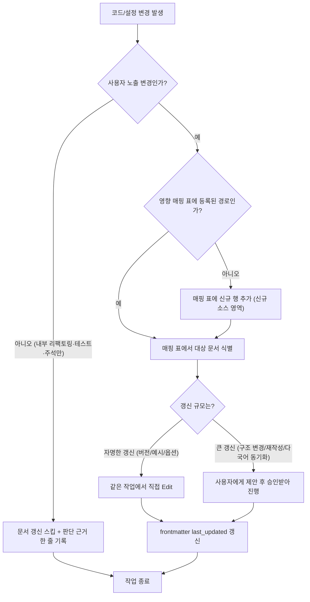

# 문서 관리 규칙

## 목적

이 문서는 웹 프로젝트의 문서(README, 아키텍처 문서, API 문서, 운영 가이드, 변경 이력 등)를 **일관되고, 최신 상태로, 신뢰 가능하게** 유지하기 위한 범용 표준이다. 사람 기여자뿐 아니라 **AI 코딩 에이전트(Claude 등)가 읽고 그대로 채택**할 수 있도록, 판단 기준을 모호한 권고가 아닌 명시적 규칙(MUST/SHOULD)과 체크리스트로 기술한다.

**채택 방법**: 이 문서를 프로젝트의 `docs/` 또는 저장소 루트에 두고, `CLAUDE.md` 또는 `AGENTS.md`에서 "코드/설정 변경 후 문서 동기화가 필요하면 `문서 관리 규칙`을 따른다"는 한 줄을 추가해 AI 에이전트가 매 작업마다 이 규칙을 자동으로 참조하도록 연결한다.

## 적용 범위

- 저장소에 커밋되는 모든 마크다운 문서: `README.md`, `docs/**/*.md`, `CHANGELOG.md`, `CLAUDE.md`/`AGENTS.md`, `CONTRIBUTING.md`, 아키텍처/설계 문서, API 문서.
- 코드와 함께 버전 관리되는 문서(docs-as-code)에 적용한다. 위키·외부 협업 툴 전용 문서는 이 규칙의 정신(SSOT, 최소 수정)을 참고하되 세부 규칙은 해당 툴 관례를 따를 수 있다.

---

## 1. 핵심 원칙

### 1.1 Docs-as-code

문서는 코드와 동일한 방식으로 다룬다: 버전 관리, 리뷰, 같은 파이프라인.

- MUST: 문서는 코드와 같은 저장소(또는 코드와 강하게 연결된 전용 문서 저장소)에 두고 Git으로 버전 관리한다.
- MUST: 코드 변경을 리뷰하는 PR/커밋에서 관련 문서 변경도 함께 리뷰한다. 문서만 별도 채널(사내 위키 캡처, 채팅 메모 등)로 관리하지 않는다.
- SHOULD: 가능하면 문서 빌드/링크 검사/마크다운 린트를 CI에 연결해 코드 CI와 동일한 신뢰 수준을 준다.
- 근거: 문서를 코드와 분리된 도구·워크플로로 관리하면 리뷰 없이 방치되어 코드보다 먼저 낡는다. Docs-as-code는 버전 관리, plain-text 마크업, 코드와 동일한 PR 리뷰, CI/CD 자동 배포를 특징으로 한다.

### 1.2 SSOT (단일 진실 공급원)

- MUST: 하나의 주제(아키텍처, API 계약, 배포 절차 등)는 **문서 1곳에서만** 정의한다. 다른 문서에서 같은 내용을 다시 서술하지 않고, 해당 SSOT 문서로 링크한다.
- MUST: 신규 주제 영역이 생기면 그 영역의 SSOT 문서를 지정하고, 이후 관련 변경은 전부 그 문서로 수렴시킨다.
- SHOULD: 프로젝트 전체의 "주제 -> SSOT 문서" 매핑을 인덱스 문서(예: `docs/00-overview/index.md`) 1곳에 유지한다.
- 안티패턴: 같은 아키텍처 설명이 README, 아키텍처 문서, 온보딩 가이드 3곳에 조금씩 다르게 적혀 있는 상태. 이는 반드시 하나로 통합한다.

### 1.3 문서 유형 분류 (Diataxis)

문서를 쓰기 전에 **이 문서가 네 가지 유형 중 무엇인지** 먼저 정한다. Diataxis 프레임워크는 사용자 요구를 튜토리얼/하우투 가이드/레퍼런스/설명 네 가지로 나눈다.

| 유형 | 목적 | 사용자 상태 | 예시 |
|------|------|-------------|------|
| 튜토리얼 (Tutorial) | 학습 경험을 손잡고 안내 | 처음 배우는 사람 | "5분 안에 로컬 환경 띄우기" |
| 하우투 가이드 (How-to) | 실무 목표 달성 방법 제공 | 이미 능숙한 사용자, 특정 문제 해결 중 | "배포 롤백하는 방법" |
| 레퍼런스 (Reference) | 정확하고 완결된 사실 정보 | 작업 중 확인이 필요한 사람 | API 엔드포인트 명세, 설정 옵션 표 |
| 설명 (Explanation) | 배경·이유·설계 결정 이해 | 왜 이렇게 되어 있는지 궁금한 사람 | "왜 이 아키텍처를 선택했는가" |

- MUST: 하나의 문서 안에서 네 유형을 뒤섞지 않는다. 튜토리얼 안에 레퍼런스 표 전체를 인용하지 말고 링크한다.
- SHOULD: 문서 디렉토리 구조를 이 네 유형(또는 그에 대응하는 프로젝트 자체 카테고리)으로 나눈다.

### 1.4 최소 수정 원칙

- MUST: 문서를 갱신할 때는 드리프트가 발생한 부분만 수정한다. 관련 없는 문장·구조를 임의로 재작성하지 않는다.
- MUST: 제목 계층, 표, 코드 블록, 기존 섹션 순서는 보존한다. 구조 변경이 꼭 필요하면 별도로 사용자 승인을 받는다.
- 근거: 관련 없는 리라이트가 섞이면 리뷰어가 실제 변경(드리프트 수정)과 스타일 변경을 구분할 수 없어 리뷰 품질이 떨어진다.

### 1.5 신규 문서 남발 금지

- MUST: 사용자/팀이 명시적으로 요청하지 않는 한 새 문서를 만들지 않는다. 기존 문서를 보강하는 방향을 우선한다.
- SHOULD: 새 문서가 꼭 필요하다고 판단되면, 왜 기존 문서에 통합할 수 없는지 먼저 확인하고(SSOT 위반 여부) 근거를 남긴 뒤 생성한다.
- 근거: 문서가 늘어날수록 SSOT 유지 비용이 커지고 중복·드리프트 위험이 커진다.

---

## 2. 문서-코드 동기화

### 2.1 영향 매핑 개념

프로젝트가 커지면 "이 코드를 고치면 어느 문서를 같이 고쳐야 하는가"를 사람이 매번 기억할 수 없다. 이를 **영향 매핑 표**로 명문화한다.

- MUST: 저장소에 "변경 파일 패턴 -> 갱신해야 할 문서" 매핑 표를 1곳(프로젝트 가이드 문서, 예: `CLAUDE.md`/`AGENTS.md`)에 SSOT로 유지한다.
- MUST: 새로운 소스 영역(신규 모듈, 신규 도메인)을 추가할 때 이 매핑 표에도 행을 추가한다.
- 매핑 표 예시 형식:

| 변경 파일(패턴) | 함께 갱신할 문서 |
|-----------------|------------------|
| `src/config/*.ts`, `.env.*.example` | `docs/operations/environment-config.md` |
| `src/api/**/*controller*`, `src/api/**/*dto*` | `docs/api/{도메인}-api.md` |
| `db/migrations/*.sql`, `src/**/entity/*` | `docs/database/schema-reference.md` |
| `src/auth/**` | `docs/architecture/security-architecture.md` |
| `README.md`, `AGENTS.md` 자체 변경 | `docs/overview/system-overview.md` |

### 2.2 동기화 판단 기준

- MUST: 사용자 노출 코드/설정(엔드포인트, 옵션, CLI 인자, 화면, 배포 절차)을 변경하면, 같은 작업(같은 커밋 또는 같은 PR) 안에서 매핑 표가 가리키는 문서를 갱신한다.
- MUST: 내부 리팩토링, 이름 변경(외부 계약 불변), 테스트 코드만 변경, 일회성 디버그 로그/주석 변경은 문서 갱신을 **스킵**할 수 있다. 단, 스킵 사유를 커밋 메시지나 작업 로그에 한 줄로 남긴다 (예: "docs sync: 내부 리팩토링만 — 스킵").
- SHOULD: 갱신 규모에 따라 처리 방식을 나눈다.
  - 자명한 갱신(버전 번호, 예시 코드, 옵션 추가/제거): 즉시 직접 수정.
  - 큰 갱신(섹션 재작성, 문서 구조 변경, 다국어 동기화): 사용자에게 제안하고 승인 후 진행.

### 2.3 동기화 판단 흐름



- SHOULD: 문서 전용 커밋은 `docs:` 접두사로 코드 커밋과 분리한다(가능한 경우).

---

## 3. 마크다운 표현 규칙

### 3.1 콘텐츠 유형 -> 표현 방식 매핑

| 콘텐츠 유형 | 사용 방식 | 금지 |
|-------------|-----------|------|
| 연계 구조·아키텍처·흐름·ERD | ` ```mermaid ` 블록 (`graph`/`flowchart`/`sequenceDiagram`/`erDiagram`) | ASCII 박스·화살표 |
| 비교표·목록·스펙·데이터 | 마크다운 테이블 `\| \| \|` | ASCII 박스 |
| 단계별 프로세스 | 번호 목록 또는 Mermaid `flowchart` | ASCII 화살표 |
| 판단/분기 로직 | Mermaid `flowchart` (분기 노드 사용) | 텍스트로 나열한 if-else 설명 |
| 로드맵·타임라인 | Mermaid `gantt` 또는 `timeline` | ASCII 타임라인 |
| 코드·명령어·설정 파일 예시 | 코드 블록 (언어 명시, 예: ` ```bash `, ` ```json `) | 본문 인라인 혼용 |

### 3.2 Mermaid 사용 원칙

- 아키텍처·시스템 연계도: `graph TD` 또는 `graph LR`
- 순서도·프로세스·판단 흐름: `flowchart TD`
- 시퀀스 다이어그램(요청/응답 흐름): `sequenceDiagram`
- ERD(테이블 관계): `erDiagram`
- 로드맵·타임라인: `gantt` 또는 `timeline`
- 노드 레이블에 자국어(한글 등)를 쓸 경우 따옴표로 감싼다: `A["사용자 요청"]`

### 3.3 ASCII 박스·다이어그램 금지 근거

`|`, `-`, `+` 등으로 그린 ASCII 박스는 모노스페이스 폰트에서도 **CJK(한중일) 문자와 섞이면 줄이 어긋난다.** CJK 문자는 폭이 ASCII 문자와 정확히 2배가 아닌 경우가 많고 폰트·터미널·렌더러마다 렌더링이 달라, 어떤 폰트를 쓰든 정렬이 보장되지 않는다. 이모지를 섞으면 문제가 더 심해진다. 따라서:

- MUST: 아키텍처·흐름·ERD는 Mermaid로, 비교/스펙/목록은 마크다운 테이블로 표현한다.
- MUST: 기존 문서에 ASCII 박스 다이어그램이 있고 그 문서를 수정하게 되면, 수정하는 김에 위 규칙대로 변환한다(문서 전체 리라이트가 아니라 해당 다이어그램만 — 최소 수정 원칙 적용).
- 예외: 팀이 명시적으로 "이번엔 변환하지 마" 라고 요청하면 해당 작업에서만 예외로 둔다.

---

## 4. 언어·표기 정책

### 4.1 단일 언어 원칙

- MUST: 문서 1개(1개 파일)의 본문은 단일 언어로 작성한다. 언어를 섞어 쓰지 않는다.
- SHOULD: 다국어 지원이 필요하면 언어별 파일을 분리한다(예: `guide.md`, `guide.en.md`). 한 파일 안에서 언어를 전환하지 않는다.

### 4.2 한자(CJK 통합 한자) 사용 금지 — 한국어 프로젝트

한국어로 작성하는 프로젝트는 아래 규칙을 위반 불가 규칙으로 적용한다.

1. **파일명·폴더명에 한자 금지**: CJK 통합 한자(대략 U+4E00~U+9FFF 대역)를 파일명·폴더명에 쓰지 않는다.
   - 위반 패턴: "분석"의 둘째 음절을 한글 자모 대신 발음이 같은 한자 글자(U+6790)로 잘못 입력한 파일명.
   - 올바른 예: `분석_보고서.md` (한글만 사용)
2. **문서 본문에 한자 혼용 금지**: 한국어 문맥에서 한자를 쓰지 않고 한글로만 표기한다.
   - 위반 패턴: "분석", "월간", "월별" 같은 단어를 한글 대신 동음 한자 글자로 표기.
   - 올바른 예: `분석`, `월간`, `월별` (전부 한글)
3. **외국 고유명사 표기**: 중국·일본 등 외국어 고유명사(인명·지명·회사명)는 로마자(핀인/헵번식) 표기 또는 한국어 표기 + 괄호 주석을 사용한다.
   - 위반 패턴: 중국인 이름을 한자 글자 그대로 본문에 노출.
   - 올바른 예: `Wu Guanghui(담당자)`

허용 범위: 한글(Hangul), ASCII, 라틴 문자, 그리고 비-CJK 문자(키릴·그리스·아랍 등)는 자유롭게 사용한다.

- SHOULD: CI 또는 pre-commit 훅에 CJK 한자 감지 검사를 추가해, 파일 경로에 한자가 있으면 커밋을 차단하고 본문에 있으면 경고를 표시한다.

### 4.3 파일 경로 표기 규칙

문서·응답에서 파일 경로를 사용자에게 보여줄 때:

- MUST: 경로에 공백 또는 자국어(한글 등) 문자가 포함되면 **백틱으로 감싼 평문 절대경로**를 사용한다. `[텍스트](file:///...)` 형태의 링크로 감싸지 않는다 — 퍼센트 인코딩(`%20`, `%EX..`)으로 표시가 깨지고 클릭도 되지 않는 경우가 있다.
  - 예: `` `/Users/example/project/문서 폴더/설계안 v1.md` ``
- MUST: 경로가 순수 ASCII이고 공백이 없으면 `[표시 이름](file:///절대경로)` 하이퍼링크를 사용해도 된다.
- SHOULD: 특정 라인을 가리킬 때는 `file_path:line` 형식을 백틱으로 표기한다(예: `` `src/index.ts:42` ``).

---

## 5. 문서 메타데이터 / 구조 보존

### 5.1 Frontmatter

- SHOULD: 문서 상단에 YAML frontmatter로 메타데이터를 관리한다. 최소 권장 필드:

```yaml
---
title: 문서 제목
last_updated: 2026-07-11
status: Active   # Active | Draft | Deprecated
owner: 담당자 또는 담당팀
---
```

- MUST: frontmatter가 있는 문서를 수정하면 `last_updated`를 오늘 날짜로 갱신한다.
- SHOULD: 더 이상 유효하지 않은 문서는 삭제하기보다 `status: Deprecated`로 표시하고 대체 문서로 링크한다(이력 보존).

### 5.2 구조 보존

- MUST: 문서를 갱신할 때 제목 계층(H1/H2/H3 순서), 기존 표의 컬럼 구성, 코드 블록의 언어 태그를 임의로 바꾸지 않는다.
- MUST: 비교표(예: 환경별 설정 비교)를 갱신할 때는 모든 열을 일관되게 갱신한다. 한 열만 고치고 나머지를 방치하지 않는다.
- MUST: 시크릿(비밀번호, API 키, PEM, 토큰)의 실제 값은 문서에 절대 기록하지 않는다. 필드명 또는 `[REDACTED]`만 표기한다.

---

## 6. 결정 기록 · 변경 이력

### 6.1 아키텍처 결정 기록 (ADR)

의미 있는 아키텍처 결정(기술 선택, 트레이드오프, 되돌리기 어려운 결정)은 ADR로 남긴다. ADR은 결정 당시의 상황과 이유를 기록해, 왜 이렇게 만들었는지를 나중에 추적 가능하게 한다.

- MUST: ADR은 각각 별도 파일로 만들고, 파일명에 단조 증가하는 번호와 결정을 요약하는 이름을 포함한다.
  - 예: `docs/adr/0001-use-postgresql-for-primary-store.md`
- SHOULD: 최소 아래 섹션을 포함한다(MADR 스타일 권장).

```markdown
# 0001. PostgreSQL을 주 데이터 저장소로 채택

## 상태
승인됨 (2026-07-11)

## 맥락
어떤 상황/제약 때문에 이 결정이 필요했는가.

## 결정
무엇을 하기로 했는가.

## 고려한 대안
기각한 대안과 기각 사유.

## 결과
이 결정으로 생기는 장점/단점/후속 영향.
```

- MUST: 기존 ADR은 수정하지 않는다. 결정이 바뀌면 새 ADR을 만들고 이전 ADR의 상태를 "대체됨(Superseded by 000X)"으로 갱신한다.

### 6.2 변경 이력 (CHANGELOG)

- MUST: 사용자에게 영향을 주는 릴리스 변경 사항은 `CHANGELOG.md`에 [Keep a Changelog](https://keepachangelog.com/) 형식으로 기록한다.
- MUST: 최신 미출시 변경은 `## [Unreleased]` 섹션에 모으고, 릴리스 시 버전 번호와 날짜로 이동한다.
- SHOULD: 변경 유형을 다음 카테고리로 분류한다: `Added`, `Changed`, `Deprecated`, `Removed`, `Fixed`, `Security`.
- SHOULD: 버전 번호는 시맨틱 버저닝(SemVer)을 따른다.

```markdown
## [Unreleased]

### Added
- 신규 기능 설명

### Fixed
- 버그 수정 설명

## [1.2.0] - 2026-07-11

### Changed
- 기존 동작 변경 설명
```

---

## 7. 문서 품질 자가 점검 체크리스트

작업을 마치기 전, 변경한 문서에 대해 아래를 확인한다.

- [ ] 이 변경이 사용자 노출 변경인가? 그렇다면 영향 매핑 표가 가리키는 문서를 갱신했는가?
- [ ] 내부 리팩토링/테스트만 변경했다면, 스킵 판단 근거를 한 줄로 남겼는가?
- [ ] 아키텍처·흐름·ERD를 ASCII 박스가 아니라 Mermaid로 표현했는가?
- [ ] 비교·스펙·목록을 마크다운 테이블로 표현했는가?
- [ ] 코드/명령어를 언어가 명시된 코드 블록으로 감쌌는가?
- [ ] 문서 본문이 단일 언어로만 작성되었는가?
- [ ] 한국어 문서라면 파일명·폴더명·본문에 한자(CJK 통합 한자)가 없는가?
- [ ] 중국/일본 고유명사를 로마자 또는 괄호 주석으로 표기했는가?
- [ ] 한글/공백 포함 경로를 백틱 평문으로, ASCII 경로를 링크로 올바르게 구분했는가?
- [ ] 드리프트가 난 부분만 수정하고 무관한 서술·구조를 보존했는가?
- [ ] frontmatter가 있는 문서라면 `last_updated`를 오늘 날짜로 갱신했는가?
- [ ] 시크릿(비밀번호/키/토큰) 평문이 문서에 남아있지 않은가?
- [ ] 새 문서를 만들었다면, 명시적 요청이 있었거나 기존 문서로 통합 불가능함을 확인했는가(SSOT 위반 없음)?
- [ ] 아키텍처 결정이라면 ADR을 남겼는가? 릴리스 변경이라면 CHANGELOG의 `Unreleased`에 기록했는가?

---

## 참고 문헌

- [Diátaxis](https://diataxis.fr/) — 튜토리얼/하우투/레퍼런스/설명 4분류 문서 프레임워크
- [Start here - Diátaxis in five minutes](https://diataxis.fr/start-here/)
- [Docs as Code — Write the Docs](https://www.writethedocs.org/guide/docs-as-code/)
- [What is Docs as Code? Guide to Modern Technical Documentation (Kong)](https://konghq.com/blog/learning-center/what-is-docs-as-code)
- [About this guide — Google developer documentation style guide](https://developers.google.com/style/)
- [Google documentation guide (google.github.io/styleguide)](https://google.github.io/styleguide/docguide/)
- [bliki: Architecture Decision Record — Martin Fowler](https://martinfowler.com/bliki/ArchitectureDecisionRecord.html)
- [Architecture decision records overview — Google Cloud](https://docs.cloud.google.com/architecture/architecture-decision-records)
- [MADR: Markdown Architectural Decision Records](https://github.com/adr/madr)
- [Architectural Decision Records (ADR)](https://adr.github.io/)
- [Keep a Changelog](https://keepachangelog.com/)
