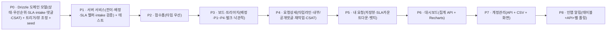

# 프로세스·프론트 재정비 (Postgres/Fastify/Drizzle 재타겟)

ITSM 재설계(상태 단순화·Impact×Urgency·SLA·타입 우선 접수·내부/공개 댓글·대시보드·CSAT)를 **완료된 정본 스택**(자체호스팅 PostgreSQL + Fastify + Drizzle + REST + 세션인증) 위에 재타겟한 통합 설계다. 도메인 결정은 이전에 확정됐고(Supabase 전제본), 이 문서는 그 결정을 **새 스택의 메커니즘에 매핑**한다.

## 1. 정본 스택 (그대로 사용)

| 레이어 | 구현 | 위치 |
|--------|------|------|
| DB | PostgreSQL 16 (Docker) | `docker-compose.yml` |
| 스키마 | Drizzle ORM + drizzle 마이그레이션 | `server/src/db/schema.ts`, `server/drizzle/*.sql` |
| API | Fastify 4 REST | `server/src/routes/*.ts` |
| 인증 | 세션 쿠키(서버측 `sessions` 저장소) + Google OAuth + dev-login | `server/src/auth/*` |
| 권한 | `authz.ts`(RLS 대체: canSeeRequest·visibilityFilter) | `server/src/authz.ts` |
| 도메인 트리거 | seq·snapshot·touch·on_status_change | `server/drizzle/0001_triggers.sql` |
| 스토리지 | 로컬 디스크(`server/uploads/`) | `server/src/storage.ts` |
| 프론트 | React + REST 클라이언트 | `src/lib/api.ts`, `src/features/**` |
| 테스트 | Fastify inject + tsx 통합 스크립트 | `server/scripts/test-*.ts` |

## 2. 재타겟 원칙 (레이어 이동)

| 재설계 결정 | 기존(Supabase 전제) | 재타겟(정본 스택) |
|-------------|--------------------|--------------------|
| 상태 전이 무결성 | DB RPC `change_request_status` | **서버 서비스 계층**(Fastify) + on_status_change 트리거는 이력/시각만 |
| 배정+우선순위 | DB RPC `assign_request` | **PATCH/전용 엔드포인트**에서 처리 |
| SLA 계산·업무시간 | plpgsql 헬퍼 | **TS 헬퍼**(server) — 앱 계층이 있어 더 단순 |
| intake 검증 | DB 함수 | **POST /api/requests 핸들러**(TS) |
| 권한(내부메모 등) | RLS | **authz.ts 확장** |
| 스키마 변경 | raw SQL 마이그레이션 | **Drizzle schema + drizzle-kit** |
| 실시간 | Supabase Realtime | **인앱 알림(폴링, SSE는 선택)** |
| 테스트 | pgTAP | **server/scripts 통합 테스트** |

## 3. 도메인 모델 변경 (Drizzle)

`server/src/db/schema.ts` + 신규 drizzle 마이그레이션으로 반영. 데이터는 seed(김주희 + request_types)만 있어 사실상 재작성 자유.

### 3.1 상태 모델
- `requestStatus` enum을 **접수·진행중·보류·완료·반려·철회** 6종으로 축소(확인·검수대기·재작업·이관 제거).
- 재작업 = 완료→진행중 전이 시 `rework_count+1`(on_status_change 트리거 이미 유사 로직 → 조정).
- 철회 = 요청자 취소(종결). 보드 컬럼 5개(접수·진행중·보류·완료·반려), 철회는 종결 필터.

### 3.2 우선순위
- 컬럼 추가: `urgency`(요청자 높음/보통/낮음), `impact`(담당), `priorityLevel`(P1~P4). 기존 `priority`는 제거 또는 보존 후 매핑.
- 격자(곱셈 아님) → 배정 시 확정. 매핑 로직은 서버 `derivePriority(urgency, impact)`.

### 3.3 SLA (두 시계·업무시간·보류 제외·스냅샷)
- 신규 테이블: `slaPolicy(priorityLevel, responseMinutes, resolutionMinutes)`, `holidays(holidayOn)`.
- requests 신규 컬럼: `assignedAt`, `responseDueAt`, `resolutionDueAt`, `firstResponseAt`, `firstResolvedAt`, `finalResolvedAt`, `slaResponseBreached`, `slaResolutionBreached`, `slaPolicyId`.
- 업무시간(KST 월–금 09–18 + holidays) 계산은 **서버 TS 헬퍼** `addBusinessMinutes()`. 응답목표=요청자 긴급도, 해결목표=확정 P레벨, 보류 구간 제외(status_history 기반).

### 3.4 접수·댓글·CSAT
- requests: `intakeDetail jsonb`(타입별 추가필드), `csatRating`(-1/1), `csatComment`, 사유(`holdReason`·`rejectReason`·`reworkReason`).
- request_comments: `isInternal boolean default true`.
- request_attachments: `commentId bigint null`(댓글 첨부).

### 3.5 뷰
- `request_view.due_status`를 `desired_due` 기준에서 **SLA 스냅샷(`resolutionDueAt`)** 기준(정상/임박/초과)으로 재정의.

## 4. 서버(Fastify) 변경

- **전이 서비스** `changeStatus(reqId, to, reason, actor)`: 허용 전이 매트릭스 검증 + 사유 + SLA 스냅샷 갱신. `PATCH /api/requests/:id` 의 status 변경 경로를 이 서비스로 단일화.
- **배정 서비스** `assignRequest(reqId, assignee, impact, actor)`: 담당·impact·priorityLevel·assignedAt·상태(접수→진행중)·해결SLA목표 원자 처리. 신규 `POST /api/requests/:id/assign` 또는 PATCH 확장.
- **SLA 헬퍼** `server/src/sla.ts`: `addBusinessMinutes`, `computeDue`, 보류 제외 경과.
- **intake 검증**: POST /api/requests 에서 타입별 `intakeDetail` 필수 키 검증(400).
- **authz 확장**: `canSeeComment`(내부메모=시스템팀·작성자만), 배정은 시스템팀 누구나.
- **신규 엔드포인트**: 대시보드 집계(`GET /api/dashboard/*`), 계정관리(`GET/PATCH /api/users`, CSV 업서트), 알림(`GET /api/notifications`, 읽음 처리), CSAT(`POST /api/requests/:id/csat`).

## 5. 프론트 변경 (화면)

| 화면 | 재정비 |
|------|--------|
| 접수 폼 | 타입 우선 조건부 필드(오류/기능/데이터/파일), 긴급도만(우선순위 삭제), 인라인 검증, 첨부 개선 |
| 내 요청 | 기본 저장뷰 "내 열린 요청", SLA 카운트다운, 접근성 뱃지(색+텍스트), 모바일 카드 |
| 관리 보드 | 미배정 큐 + "나에게 배정"(+impact→P1~P4), 컬럼 건수(WIP), 낙관적 업데이트, 벌크, 종결 필터 |
| 요청 상세 | 통합 타임라인, 내부/공개 댓글(+첨부), 재작업 버튼, SLA 카운트다운, CSAT |
| 대시보드(신규) | 중앙값 리드타임·노화·SLA준수율·재작업율·CSAT (Recharts) |
| 계정관리(신규) | 사용자 목록·역할/부서/기관 수정·CSV |
| 전역 | 인앱 알림 벨(폴링), 접근성 `Badge`(라벨 필수), 디자인 토큰 |

## 6. 단계별 실행계획 (정본 스택)

- **P0/P1이 관문**: 스키마 + 서비스 계층에서 상태·SLA·전이·권한을 확정. 이후 화면은 그 위에서 구현.
- 각 단계는 `server/scripts/test-*.ts` 통합 테스트로 게이트. 프론트는 `npm run typecheck`/`build`.

## 7. 범위 외 (유지)
SLA 캘린더 엔진·OLA, 자동 라우팅, AI 디플렉션/KB, 5×5 우선순위, 이메일 알림(현 단계), Slack 동기화, CSV 내보내기. + 실시간은 폴링(엔터프라이즈 Realtime 아님).

## 8. 결정 로그 (재타겟 반영)
| 항목 | 값 |
|------|-----|
| 정본 스택 | Postgres/Fastify/Drizzle/REST/세션인증 (다른 세션 완료) |
| 재설계 도메인 | 이전 확정본 유지(상태 6종·Impact×Urgency P1~P4·SLA 두 시계·재작업 루프·보류 정지) |
| 전이/SLA/검증 위치 | DB RPC → **서버 서비스 계층** |
| 스키마 도구 | raw SQL → **Drizzle** |
| 권한 | RLS → **authz.ts** |
| 실시간 | Supabase Realtime → **인앱 폴링(SSE 선택)** |
| 테스트 | pgTAP → **Fastify inject 통합 스크립트** |
| 폐기물 | Supabase P0(supabase CLI·baseline·pgTAP·DB RPC)은 `wip/supabase-p0-redesign` 보존 후 정리 |
