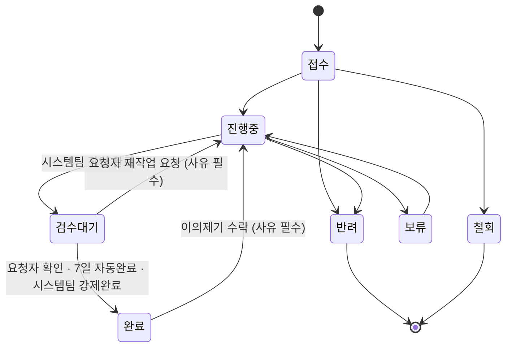

# 완료 검수 단계와 이의제기 설계

## 1. 문제

완료 처리된 요청을 요청자가 "잘못 처리됐다"고 판단했을 때, 앱 안에서 할 수 있는 일이 없다.

재작업 메커니즘 자체는 이미 있다. `완료 → 진행중` 전이가 존재하고 `rework_reason`을 남기며 `rework_count`를 올리고 SLA 위반 플래그를 리셋한다 (`server/src/services/transition.ts`, `server/drizzle/0004_fix_due_status_labels.sql`). 문제는 **이 전이를 시스템팀만 실행할 수 있다**는 점이다. 요청자에게 허용된 상태 변경은 `접수 → 철회` 하나뿐이다 (`server/src/routes/requests.ts:148`).

따라서 요청자는 메신저나 전화로 시스템팀에 알리고, 시스템팀이 대신 상태를 되돌려야 한다. 이 경로는 기록에 남지 않으므로 "완료했는데 사실은 아니었던 건"이 몇 건인지, 왜 그랬는지 집계할 수 없다.

이를 두 방향에서 함께 해결한다.

- **예방**: 요청자 확인을 거쳐야 완료가 확정되도록 `검수대기` 단계를 넣는다.
- **사후 구제**: 최종 완료된 건에도 요청자가 이의를 제기할 수 있는 통로를 만든다.

## 2. 결정 사항

| 항목 | 결정 | 근거 |
|------|------|------|
| 접근 방향 | 검수대기 단계 + 완료 후 이의제기 (둘 다) | 예방만으로는 나중에 드러나는 문제를 못 잡고, 사후 구제만으로는 잘못된 완료가 계속 발생한다 |
| 검수 무응답 처리 | 7일 후 자동 완료 (3일차 리마인더) | 무기한 대기는 건을 영원히 안 닫히게 한다. 사후 이의제기 통로가 있으므로 자동완료의 손해는 복구 가능하다 |
| 이의제기 처리 | 시스템팀 심사 후 수락/기각 | 요청자 재량으로 즉시 되살아나면 백로그와 지표가 통제 불가능해진다. 기각 기록도 운영 개선 근거가 된다 |
| 데이터 모델 | 별도 테이블 + 상태는 `완료` 유지 | 상태값으로 만들면 심사 기간 동안 완료 건수·리드타임 집계가 출렁인다 |
| 이의제기 기한 | 최종 완료 후 14일 | 그 이후 발견된 문제는 새 요청으로 접수하는 것이 맞다 |
| 이의제기 횟수 | 제한 없음 (동시에 열린 이의는 1건) | `rework_count`가 반복 건을 자연히 드러내므로 운영으로 푼다 |

## 3. 상태 머신

`검수대기` 상태값을 추가하고, `진행중 → 완료` 직행을 제거한다. 작업이 끝나면 반드시 검수대기를 거친다.



### 전이 매트릭스

`ALLOWED_TRANSITIONS`(`src/lib/constants.ts`)와 `ALLOWED`(`server/src/services/transition.ts`)를 아래와 같이 맞춘다.

| from | to | 실행 주체 | 사유 |
|------|-----|-----------|------|
| 접수 | 진행중 / 반려 | 시스템팀 | 반려 시 필수 |
| 접수 | 철회 | 요청자 본인 | 선택 |
| 진행중 | 검수대기 | 시스템팀 | 선택 |
| 진행중 | 보류 / 반려 | 시스템팀 | 필수 |
| 보류 | 진행중 | 시스템팀 | 선택 |
| 검수대기 | 완료 | 요청자 본인 / 자동 배치 / 시스템팀 | 시스템팀 강제완료 시 필수 |
| 검수대기 | 진행중 | 요청자 본인 | 필수 (`rework_reason`) |
| 완료 | 진행중 | 시스템팀 (이의제기 수락 경로만) | 필수 (`rework_reason`) |

`완료 → 진행중`은 기존 전이를 그대로 재사용한다. 달라지는 것은 이 전이를 촉발하는 조건뿐이며, 상태 머신에 이의제기 전용 분기를 만들지 않는다.

### 완료 경로

완료에 도달하는 경로가 셋이므로 `completion_route` 컬럼으로 구분해 기록한다.

| 코드값 | 의미 |
|--------|------|
| `REQUESTER` | 요청자가 검수에서 직접 확인 |
| `AUTO` | 7일 무응답으로 자동 완료 |
| `SYSTEM_FORCED` | 시스템팀이 검수를 건너뛰고 강제 완료 (사유 필수) |

강제 완료는 요청자 확인을 생략하는 행위이므로 사유를 필수로 받는다. 강제 완료된 건도 이의제기 통로는 동일하게 열려 있다.

## 4. 시간 지표 재정의

요청자가 검수를 늦게 해서 팀의 해결 SLA가 위반되는 것은 부당하다. 따라서 SLA는 "팀이 작업에서 손을 뗀 시점", 리드타임은 "요청자가 납득한 시점"으로 기준을 분리한다.

| 컬럼 | 새 의미 | 쓰이는 곳 |
|------|---------|-----------|
| `first_resolved_at` | 처음 `검수대기`에 진입한 시각 | 해결 SLA 판정, 팀 실작업 리드타임 |
| `completed_at`, `final_resolved_at` | 최종 완료(확인·자동·강제) 시각 | 종결 리드타임 |
| `inspection_due_at` (신규) | 검수대기 진입 시각 + 7일 | 자동완료 배치 조회 조건 |
| `rework_count` | 진행중으로 되돌아간 총 횟수 | 재작업률 |
| `completion_route` (신규) | 완료 경로 코드값 | 완료 품질 지표 |

`on_status_change` 트리거(`server/drizzle/0004_fix_due_status_labels.sql`)를 수정한다.

- `검수대기` 진입 시 `first_resolved_at`과 `inspection_due_at`을 세팅한다. `sla_resolution_breached` 판정도 이 시점을 기준으로 한다.
- `완료` 진입 시 `completed_at`·`final_resolved_at`을 세팅한다.
- `rework_count`는 현재 `완료 → 진행중`만 증가시키는데, `검수대기 → 진행중`도 증가시키도록 넓힌다.
- `검수대기 → 진행중` 및 `완료 → 진행중` 시 `inspection_due_at`·`completion_route`를 `null`로 되돌린다.

## 5. 데이터 모델

상태 enum에 값을 추가하는 것 외에 이의제기는 별도 테이블에 쌓는다. 이의제기 중에도 요청은 `완료` 상태로 남아 있으므로 심사 기간 동안 완료 건수와 리드타임 집계가 흔들리지 않는다.

```sql
create table request_disputes (
  id             bigserial primary key,
  request_id     bigint not null references requests(id),
  raised_by      uuid   not null references users(id),
  reason         text   not null,
  status_cd      varchar(16) not null default 'OPEN'
                 check (status_cd in ('OPEN', 'ACCEPTED', 'REJECTED')),
  reviewed_by    uuid references users(id),
  review_comment text,
  reviewed_at    timestamptz,
  created_at     timestamptz not null default now(),
  updated_at     timestamptz not null default now()
);

-- 한 건에 동시에 열린 이의는 1개만 허용
create unique index request_disputes_one_open
  on request_disputes (request_id) where status_cd = 'OPEN';
```

CLAUDE.md §2의 신규 테이블 규칙을 따랐다. 예약어 `status` 대신 `status_cd`, 코드값은 영문 `SCREAMING_SNAKE_CASE`, 감사 컬럼 `created_at`/`updated_at` 필수.

열린 이의 여부는 `requests`에 컬럼으로 중복 저장하지 않고 `request_view`에 `has_open_dispute` 파생 필드로 노출한다. 목록·보드의 뱃지와 필터가 이 필드를 읽는다.

기각(`REJECTED`)된 이의도 행으로 남는다. "요청자가 불만을 제기했으나 범위 밖이었다"는 사실이 집계돼야 구현 품질 문제인지 요건 정의 문제인지 구분할 수 있다.

### RLS

`request_disputes`는 해당 `request_id`에 대한 읽기 권한이 있는 사용자만 조회할 수 있다. 생성은 요청자 본인, 심사(`update`)는 시스템팀으로 제한한다.

## 6. API

| 엔드포인트 | 권한 | 동작 |
|-----------|------|------|
| `POST /api/requests/:id/disputes` | 요청자 본인 | 상태가 `완료`, `completed_at`이 14일 이내, 열린 이의 없음일 때만 허용. `reason` 필수. 시스템팀 전원에게 알림 발송 |
| `PATCH /api/disputes/:id` | 시스템팀 | `{ decision: 'ACCEPTED' \| 'REJECTED', comment }`. `ACCEPTED`면 같은 트랜잭션에서 `changeStatus(완료 → 진행중, reason)`을 호출한다. `REJECTED`면 상태를 유지하고 `review_comment`를 남긴다. 두 경우 모두 요청자에게 알림 |
| `PATCH /api/requests/:id` (수정) | 요청자 본인 | 현재 상태가 `검수대기`일 때에 한해 `완료`(확인, `csat_rating` 동반 가능)와 `진행중`(재작업 요청, `reason` 필수) 전이를 허용한다 |

`PATCH /api/requests/:id`의 권한 분기(`server/src/routes/requests.ts:148`)에 현재 `ownerCancel`(접수 → 철회)만 있으므로, `ownerApprove`(검수대기 → 완료)와 `ownerRework`(검수대기 → 진행중)를 추가한다.

이때 기존 가드와 충돌한다. `requests.ts:144`는 stale-status 우회를 막기 위해 상태 변경과 필드 수정을 한 요청에 섞는 것을 금지한다. 검수 승인은 `완료` 전이와 `csat_rating`·`csat_comment` 저장을 함께 해야 하므로, 이 두 필드는 `검수대기 → 완료` 전이에 한해 동반을 허용하는 예외를 명시적으로 둔다. 나머지 필드(`title`, `body`, `urgency`, `visibility`, `desired_due`, `assignee_id`)에 대한 금지는 그대로 유지한다.

이의제기 수락은 반드시 하나의 트랜잭션 안에서 `request_disputes.status_cd = 'ACCEPTED'` 갱신과 상태 전이를 함께 수행한다. 부분 실패로 "수락됐는데 상태는 완료"인 상태가 생기면 안 된다.

### 자동완료 배치

서버에 1시간 주기 배치를 둔다. `status = '검수대기' and inspection_due_at < now()`인 건을 `AUTO` 경로로 완료 처리하고 요청자에게 알림을 보낸다. 검수대기 진입 후 3일이 지났고 아직 응답이 없는 건에는 리마인더 알림을 보낸다(건당 1회).

배치는 RLS를 통과해야 하므로 시스템 액터로 `withUser`를 호출한다.

### 알림

`notifications.type`에 `dispute` 값을 추가한다. 발송 시점은 다음과 같다.

| 시점 | 수신자 | 내용 |
|------|--------|------|
| 검수대기 진입 | 요청자 | 확인 요청 + 자동완료 예정일 |
| 검수대기 3일 경과 | 요청자 | 리마인더 |
| 자동완료 | 요청자 | 자동 완료됨 + 이의제기 가능 안내 |
| 이의제기 접수 | 시스템팀 전원 | 심사 요청 |
| 이의 심사 완료 | 요청자 | 수락(재작업 착수) 또는 기각(사유) |

## 7. 화면

### 요청자

검수대기 상태이고 본인 요청이면 `RequestDetail` 상단에 확인 패널을 띄운다. 자동완료 예정일을 함께 안내하고 두 개의 동작을 제공한다.

- **확인했습니다**: 별점 1~5와 선택 코멘트를 받는 모달을 띄우고 `csat_rating`·`csat_comment`를 저장하며 `완료`(`REQUESTER`)로 전이한다. `csat_rating` 컬럼은 이미 존재하나 현재 채워지는 경로가 없다. 요청자가 완료를 승인하는 이 순간이 만족도를 묻기에 자연스러운 유일한 지점이다.
- **다시 봐주세요**: 사유 입력(필수) 모달을 띄우고 `진행중`으로 되돌린다.

완료 상태에서는 14일 이내이고 열린 이의가 없을 때만 `이의제기` 버튼을 노출한다.

- 이미 이의를 제기한 상태면 버튼 대신 "심사 중"과 제기 사유를 보여준다.
- 14일이 지났으면 "이의제기 기간이 지났습니다. 새 요청으로 접수해주세요"를 안내하고, 원본을 `parent_request_id`로 연결한 새 요청 작성 링크를 제공한다.

### 시스템팀

칸반(`BOARD_STATUSES`)의 `진행중`과 `완료` 사이에 `검수대기` 컬럼을 넣는다. 이 컬럼의 카드에는 자동완료까지 남은 일수를 표시해, 요청자를 재촉할지 강제 완료할지 판단할 수 있게 한다.

열린 이의가 있는 건은 `완료` 컬럼에 남되 뱃지를 단다. 완료 컬럼에 묻히면 안 되므로 대시보드 상단에 "심사 대기 중인 이의 N건"을 별도로 노출한다. 상세 화면에서 `수락 → 재작업`과 `기각` 두 동작을 제공하며, 기각은 사유를 필수로 받아 요청자에게 그대로 전달한다.

## 8. 지표

기존 `rework_rate`(`server/src/routes/dashboard.ts`)는 정의가 넓어진다. 지금은 완료 건 중 `rework_count > 0`인 비율인데, 검수대기 반려도 여기 포함된다. 이는 의도한 변화다. "요청자가 한 번에 만족하지 못한 비율"이 재작업률이 원래 재려던 값이다.

새로 추가하는 지표는 넷이다.

| 지표 | 읽는 법 |
|------|---------|
| 이의제기율 (완료 건 대비) | 검수를 통과하고도 나중에 문제가 드러난 비율. 높으면 검수가 형식적이라는 뜻 |
| 이의 수락률 | 수락이 높으면 구현 품질 문제, 기각이 높으면 요건 정의·기대치 관리 문제 |
| 평균 검수 소요일 | 요청자가 확인에 걸리는 시간. 길면 알림이 닿지 않고 있는 것 |
| 완료 경로 분포 (`REQUESTER` / `AUTO` / `SYSTEM_FORCED`) | `AUTO` 비중이 크면 "완료" 숫자가 사실은 무응답이라는 뜻 |

마지막 지표가 이 설계 전체의 안전장치다. 검수 단계를 넣었는데 요청자들이 아무도 확인하지 않으면 완료가 7일 늦어질 뿐 품질은 나아지지 않는다. `AUTO` 비율이 그 실패를 즉시 드러낸다.

## 9. 변경 범위

### 마이그레이션 (`server/drizzle/0005_*.sql`)

- `request_status` enum에 `검수대기` 추가
- `requests`에 `inspection_due_at timestamptz`, `completion_route varchar(16)` 추가
- `request_disputes` 테이블 및 부분 유니크 인덱스 생성, RLS 정책 추가
- `notifications.type`에 `dispute` 추가
- `on_status_change` 트리거 교체 (§4)
- `request_view`에 `has_open_dispute` 추가

forward-only이며 기존 마이그레이션 파일은 편집하지 않는다. drizzle journal 등록을 잊지 않는다(`0004`에서 누락된 전례가 있다).

### 서버

- `server/src/services/transition.ts` — 전이 매트릭스, `completion_route` 세팅, 사유 컬럼 분기
- `server/src/routes/requests.ts` — 요청자 검수 권한 분기 추가
- `server/src/routes/disputes.ts` (신규) — 이의제기 생성·심사
- `server/src/jobs/auto-complete.ts` (신규) — 자동완료·리마인더 배치
- `server/src/routes/dashboard.ts` — 신규 지표 4종

### 프론트

- `src/lib/constants.ts` — `STATUS_OPTIONS`, `BOARD_STATUSES`, `OPEN_STATUSES`, `STATUS_BADGE`, `ALLOWED_TRANSITIONS`
- `src/types/database.ts` — `RequestStatus`, `RequestDispute`
- `src/features/requests/RequestDetail.tsx` — 검수 패널, 이의제기 UI, 시스템팀 심사 UI
- `src/features/requests/api.ts` — 이의제기 API 클라이언트
- `src/features/dashboard/Dashboard.tsx` — 검수대기 컬럼, 이의 알림 배너, 신규 지표

### 문서 (CLAUDE.md §1 영향 매핑)

- `docs/reference/db-schema.md` — 신규 테이블·컬럼·enum·RLS
- `docs/reference/requirements.md` — 검수·이의제기 흐름
- `CHANGELOG.md` — `Unreleased`

## 10. 열린 질문

- 요청자가 퇴사해 계정이 비활성인 검수대기 건은 자동완료 배치가 그대로 처리한다. 별도 처리는 두지 않는다.
- 검수대기 상태의 건도 `보류`로 갈 수 있어야 하는지는 현재 설계에서 제외했다. 검수 중 보류가 필요하면 요청자가 재작업 요청을 하고 시스템팀이 진행중에서 보류로 보내면 된다.
