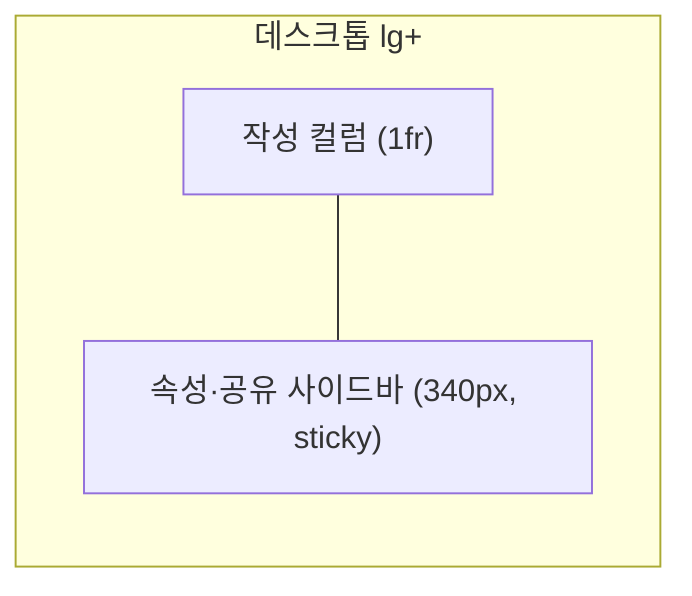

# 접수폼 레이아웃 재설계 (2-페인)

`src/features/requests/RequestForm.tsx`(요청 접수 화면)를 넓은 화면을 제대로 쓰는 **2-페인 레이아웃**으로 재설계한다. 인테이크/티켓 폼 베스트 사례(Linear·Zendesk·Notion·Jira·GitHub Issue Forms)와 NN/g 폼 가이드를 근거로 한다.

**시각 기준(목업)**: `public/mockup-request-form.html` (검토용 정적 목업, 확정본. 구현 후 제거 예정).

## 1. 목표 · 근거

- 풀폭 전환 후 단일 컬럼 필드가 좌우로 늘어져 허전한 문제 해결 + 넓은 폭을 실제로 활용.
- 근거: 폼 필드는 **단일 컬럼**이 정답(NN/g — 다열 폼은 완료율↓·지그재그 스캔). 넓은 화면은 필드를 늘리지 않고 **작성 컬럼 + 속성 사이드바 2-페인**으로 쓴다.
- 오분류·누락 감소를 위해 타입 우선·필드별 도움말·필수표시·기본값·점진적 공개를 적용.

## 2. 레이아웃 (반응형 2-페인)

- 셸: `grid grid-cols-1 gap-6 lg:grid-cols-[minmax(0,1fr)_340px]` — **전체 폭 채움**(중앙 캡 없음). 메인은 남는 폭을 채우고 사이드바는 340px 고정.
- **≥lg**: 2-페인, 사이드바 `sticky top-6`. **<lg**: 단일 컬럼 스택(DOM 순서 = 작성 → 속성, 접근성 유지). 모바일은 하단 고정 제출바.
- 접수 완료 확인 카드는 기존대로 **중앙 정렬 유지**(전환 화면).

## 3. 필드 배치

| 영역 | 필드(순서) |
|------|-----------|
| 작성 컬럼(주) | 유형(카드) → 유형별 상세(조건부) → 제목 → **상세내용(에디터 영역)** → 첨부(드롭존) |
| 속성·공유 사이드바 | 긴급도 · 희망완료일(한 행) → 공개범위 → 공유대상(접기) → 제출 버튼 |

- 상단 헤더에 소속기관 뱃지 유지.

## 4. 컴포넌트 변경

- **유형 선택**: 드롭다운 → **카드 4종**(오류·기능요청·데이터추출·파일변경, 아이콘+라벨+힌트). `role=radiogroup`으로 키보드/스크린리더 지원. 선택 시 유형별 상세 노출.
- **유형별 상세**: 파란 섹션, 각 필드에 라벨·도움말(placeholder)·필수(`*`) 표시(기존 로직 유지, 배치만 조정).
- **상세내용 = 에디터 영역(슬롯)**: 향후 **서상연 팀장 제작 에디터로 교체 예정**. 이번 범위는 **영역/레이아웃만 확정**하고 교체 가능한 컴포넌트 슬롯으로 둔다. 잠정 구현은 기존 `textarea`(또는 최소 bordered 영역)로 유지하며 `body`를 그대로 전송. **리치 에디터·본문 인라인 이미지 업로드는 이번 범위 밖**(에디터 교체 시 함께 처리).
- **첨부**: 파일 input → **드롭존**(드래그드롭 + 용량/확장자 검증 + 파일 칩). 업로드 진행률은 선택(후속).
- **기본값·점진적 공개**: 긴급도 `보통`·공개범위 `부서` 기본값 유지. **공유대상 기본 접힘** → "+ 공유대상 추가"로 펼침.
- **제출바**: 사이드바 하단 `sticky`(데스크톱)/하단 고정(모바일). 주 버튼 "접수하기".

## 5. 접근성

- 두 영역 `aria-label`(요청 작성 / 속성·공유). 유형 카드 라디오그룹. 필드 라벨 연결·필수표시·인라인 오류(기존).

## 6. 불변 (유지)

- API 계약(POST `/api/requests`: org·type_code·title·body·urgency·visibility·desired_due·intake_detail·sharedTargets)·검증 로직·제출 흐름·접수번호 발급·타입 우선 조건부·sharedTargets 다중선택.

## 7. 범위 밖 (이번 제외)

- 리치 텍스트 에디터 실제 구현 및 **본문 인라인 이미지 업로드 API**(서상연 팀장 에디터 교체 시 처리 — 영역만 확보).
- 첨부 업로드 진행률(후속).

## 8. 성공 기준

- 넓은 화면에서 메인 작성 컬럼 + 340px 속성 사이드바가 간격 낭비 없이 배치, 좁은 화면에서 단일 컬럼으로 자연스럽게 스택.
- 유형을 카드로 선택 → 조건부 필드 노출, 필수/도움말 명확, 기본값으로 빠른 반복 접수.
- 상세내용 영역이 향후 외부 에디터로 교체 가능한 슬롯으로 존재. typecheck/build 통과, 다른 화면 회귀 없음.

## 9. 결정 로그

| 항목 | 값 |
|------|-----|
| 레이아웃 | 2-페인 반응형, 전체 폭 채움(사이드바 340px sticky) |
| 유형 선택 | 카드형 라디오그룹 |
| 상세내용 | 에디터 **영역만** 확보(잠정 textarea), 향후 서상연 팀장 에디터로 교체 |
| 인라인 이미지 | 이번 범위 밖(에디터 교체 시) |
| 첨부 | 드롭존 |
| 공유대상 | 기본 접힘(점진적 공개) |
| 완료 확인 카드 | 중앙 정렬 유지 |
