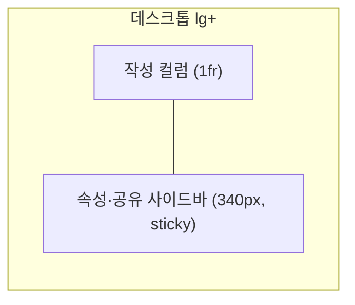

# 접수폼 레이아웃 재설계 (2-페인)

`src/features/requests/RequestForm.tsx`(요청 접수 화면)를 넓은 화면을 제대로 쓰는 **2-페인 레이아웃**으로 재설계한다. 인테이크/티켓 폼 베스트 사례(Linear·Zendesk·Notion·Jira·GitHub Issue Forms)와 NN/g 폼 가이드를 근거로 한다.

**시각 기준(목업)**: `public/mockup-request-form.html` (검토용 정적 목업, 확정본. 구현 후 제거 예정).

## 1. 목표 · 근거

- 풀폭 전환 후 단일 컬럼 필드가 좌우로 늘어져 허전한 문제 해결 + 넓은 폭을 실제로 활용.
- 근거: 폼 필드는 **단일 컬럼**이 정답(NN/g — 다열 폼은 완료율↓·지그재그 스캔). 넓은 화면은 필드를 늘리지 않고 **작성 컬럼 + 속성 사이드바 2-페인**으로 쓴다.
- 오분류·누락 감소를 위해 타입 우선·필드별 도움말·필수표시·기본값·점진적 공개를 적용.

## 2. 레이아웃 (반응형 2-페인)

- 셸: `grid grid-cols-1 gap-6 lg:grid-cols-[minmax(0,1fr)_340px]`. 일반 화면에서 **전체 폭 채움**, 단 셸에 **상한 `max-w-[1600px]`**(초광폭에서 본문 행이 지나치게 길어지지 않게 — 1600px 이하는 사실상 풀폭). 메인이 남는 폭을 채우고 사이드바는 340px 고정.
- **≥lg**: 2-페인. **사이드바 카드 전체가 `sticky top-6`**(카드 안 제출 버튼에 별도 sticky 불필요). **<lg**: 단일 컬럼 스택(DOM 순서 = 작성 → 속성, 접근성 유지) + **하단 고정 제출바**.
- **사이드바 내부**: 긴급도·희망완료일 2열은 **좁은 폭/확대 시 1열 fallback**(긴 한국어 라벨·날짜피커 대비).
- **모바일 하단 고정 제출바**: `env(safe-area-inset-bottom)` 반영, 본문 하단에 제출바 높이만큼 padding(콘텐츠 가림 방지), 제출 버튼은 **한 곳만**(사이드바 카드 내 버튼과 중복 노출 금지 — 모바일에선 하단바만), 가상 키보드/날짜피커와 겹치지 않게.
- 접수 완료 확인 카드는 기존대로 **중앙 정렬 유지**(전환 화면).

## 3. 필드 배치

| 영역 | 필드(순서) |
|------|-----------|
| 작성 컬럼(주) | 유형(카드) → 유형별 상세(조건부) → 제목 → **상세내용(에디터 영역)** → 첨부(드롭존) |
| 속성·공유 사이드바 | 긴급도 · 희망완료일(한 행) → 공개범위 → 공유대상(접기) → 제출 버튼 |

- 상단 헤더에 소속기관 뱃지 유지.

## 4. 컴포넌트 변경

- **유형 선택**: 드롭다운 → **카드형**(오류·기능요청·데이터추출·파일변경, 아이콘+라벨+힌트). **네이티브 `<input type="radio">`를 시각적으로 카드화**(라벨로 감싸기)해 키보드(Tab 진입·방향키)·스크린리더를 표준으로 지원(플레인 button+`role=radiogroup`은 지양). 카드는 API `request_types`에서 동적 렌더(로딩/빈 목록 상태 처리). 선택 시 유형별 상세 노출.
- **유형별 상세**: 파란 섹션, 각 필드에 라벨(고유 `id`+`htmlFor`)·도움말·필수(`*`)·오류 시 `aria-invalid`+`aria-describedby`. 유형 변경 시 값 초기화(기존 로직 유지).
- **상세내용 = 에디터 영역(슬롯)**: 향후 **서상연 팀장 제작 에디터로 교체 예정**. 이번 범위는 **영역/레이아웃만 확정**한 **교체 가능한 컴포넌트 슬롯**. 잠정 구현은 `textarea`, **본문 값 형식 = plain text**(`body: string`)로 그대로 전송. 슬롯 계약(교체 시 지킬 인터페이스)을 명문화한다:
  - props: `value: string`, `onChange(v: string)`, `disabled`, `aria-labelledby`(상세내용 라벨), `id`, 최소 높이(≈200px).
  - **리치 에디터·HTML 저장·sanitize·본문 인라인 이미지 업로드는 범위 밖**(에디터 교체 시 `body_format` 도입 여부·XSS sanitize·상세화면 렌더링을 함께 결정).
- **첨부**: 파일 input → **드롭존**(드래그드롭 + 클릭 선택(숨김 input+label, 키보드 가능) + 파일 칩(제거 버튼 접근성)). **제한을 서버와 통일**(파일당 20MB, 서버 허용 확장자/MIME·개수와 동일한 단일 계약)로 클라이언트 사전검증. **부분 실패 처리**: 요청 생성 후 파일 순차 업로드 중 일부 실패 시 — 요청은 이미 생성됐으므로 **재제출로 요청을 중복 생성하지 않고**, 실패한 파일만 표시·재시도. 제출 결과에 "요청 접수됨 · 첨부 N건 중 M건 실패(재시도)"를 구분 표시. 업로드 진행률은 선택(후속).
- **기본값·점진적 공개**: 긴급도 `보통`·공개범위 `부서` 기본값 유지. **공유대상 기본 접힘** → "+ 공유대상 추가"로 펼침. **접었다 펴도 선택값 보존**, 접힌 상태에 **선택 수 뱃지** 표시.
- **제출**: 사이드바 카드 전체가 sticky(데스크톱)/하단 고정바(모바일). 주 버튼 "접수하기". **제출 중 버튼 비활성화(중복 제출 방지) + 입력 잠금**.

## 5. 접근성

- 두 영역 `aria-label`(요청 작성 / 속성·공유). 유형 카드 = 네이티브 radio. 필드 라벨 연결·필수표시·인라인 오류(`aria-invalid`/`aria-describedby`).
- **제출 검증 실패 시 첫 오류 필드로 포커스+스크롤 이동**(2-페인·모바일에서 사이드바 필수값(희망완료일 등)을 놓치지 않게).

## 6. 불변 (유지)

- API 계약(POST `/api/requests`: org·type_code·title·body·urgency·visibility·desired_due·intake_detail·sharedTargets)·검증 로직·제출 흐름·접수번호 발급·타입 우선 조건부·sharedTargets 다중선택.

## 7. 범위 밖 (이번 제외)

- 리치 텍스트 에디터 실제 구현 및 **본문 인라인 이미지 업로드 API**(서상연 팀장 에디터 교체 시 처리 — 영역만 확보). 목업(`public/mockup-request-form.html`)의 리치 툴바·인라인 이미지는 **교체 후의 미래 모습**이며 이번 구현은 슬롯(잠정 textarea)만 만든다.
- 첨부 업로드 **진행률 표시**(후속). 단 **부분 실패 처리·중복 요청 방지·재시도는 이번 범위 포함**(§4).
- `body_format`/HTML sanitize/상세화면 HTML 렌더링(에디터 교체 시 결정).

## 8. 성공 기준

- 넓은 화면에서 메인 작성 컬럼 + 340px 속성 사이드바가 간격 낭비 없이 배치, 좁은 화면에서 단일 컬럼으로 자연스럽게 스택.
- 유형을 카드로 선택 → 조건부 필드 노출, 필수/도움말 명확, 기본값으로 빠른 반복 접수.
- 상세내용 영역이 향후 외부 에디터로 교체 가능한 슬롯으로 존재. typecheck/build 통과, 다른 화면 회귀 없음.

**검증 시나리오(수동 확인 항목)**
- 키보드만으로 전체 작성·제출 가능(유형 카드 방향키 선택, 드롭존 키보드 선택, 필수 미충족 시 첫 오류로 포커스 이동).
- 반응형: ≥lg 2-페인, <lg 스택, 초광폭(≥1600px) 본문 행 길이 상한 확인, 320px급·사이드바 좁을 때 긴급도/날짜 1열 fallback.
- 첨부 부분 실패: 파일 1건 실패를 유도(예: 초과 용량) → 요청은 1건만 생성·중복 없음, 실패 파일만 재시도, 결과 메시지에 부분 실패 표시.
- 제출 중 중복 클릭 시 요청 중복 생성 안 됨.

## 9. 결정 로그

| 항목 | 값 |
|------|-----|
| 레이아웃 | 2-페인 반응형, 풀폭(셸 상한 `max-w-[1600px]`), 사이드바 340px 카드 sticky, 모바일 하단바 |
| 유형 선택 | **네이티브 radio** 카드(동적 렌더) |
| 상세내용 | 에디터 **영역/슬롯만** 확보(잠정 textarea, **body=plain text**), 슬롯 props 계약 명문화, 향후 서상연 팀장 에디터로 교체 |
| 인라인 이미지·HTML | 이번 범위 밖(에디터 교체 시 body_format·sanitize 결정) |
| 첨부 | 드롭존, 서버와 제한 통일(20MB), **부분 실패 재시도·중복 요청 방지 범위 포함**(진행률은 후속) |
| 검증 | 제출 실패 시 첫 오류로 포커스 이동, 제출 중 중복 방지 |
| 공유대상 | 기본 접힘(점진적 공개) |
| 완료 확인 카드 | 중앙 정렬 유지 |
