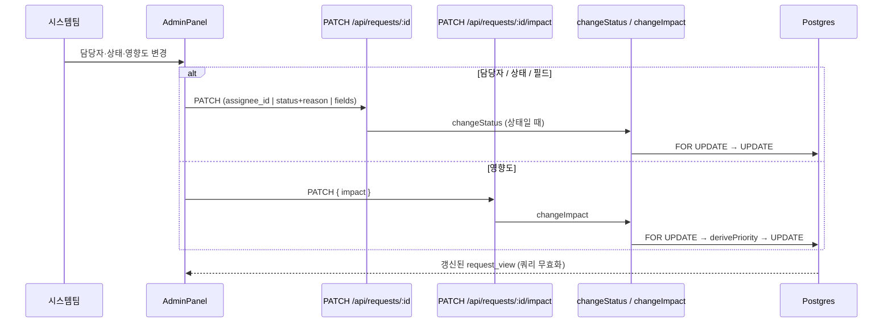

# 관리보드 접수 영역 분할 · 요청 상세 관리 패널

## 배경

관리보드(`src/features/board/ManageBoard.tsx`)에 두 가지 문제가 있다.

1. **접수 건 중복 표시.** 미배정 큐는 `status='접수' && assignee_id is null`을 보여주고(`ManageBoard.tsx:292`), 칸반 접수 컬럼은 필터를 통과한 `status='접수'` 전부를 보여준다(`ManageBoard.tsx:330`). 담당자 없는 접수 건은 두 곳에 동시에 나타난다.

2. **상세 화면에 관리 기능이 없다.** 관리보드 카드를 클릭하면 요청자와 동일한 `/requests/:id`로 이동한다. 이 화면에서 시스템팀에게 열려 있는 것은 재작업 버튼과 내부 메모 토글뿐이다. 담당자·상태·영향도를 바꾸려면 보드로 되돌아가야 하고, 필드 편집은 UI가 "요청자 본인 && 접수"로 막혀 있다(`RequestDetail.tsx:220`) — 서버는 시스템팀에게 이미 허용하는데도 그렇다(`server/src/routes/requests.ts:171`).

## 목표

- 접수 상태 건이 보드에서 정확히 한 곳에만 나타난다.
- 시스템팀이 상세 화면을 벗어나지 않고 담당자·상태·영향도·본문을 관리한다.

## 비목표

- 관리자 전용 라우트 신설. 기존 `/requests/:id`를 역할로 분기한다.
- 요청자 화면의 정보 구조 변경. 요청자가 보는 것은 지금과 같다.
- 전이 매트릭스 자체의 변경. `진행중 → 접수` 허용은 이미 반영돼 있다.

---

## 1. 접수 영역 분할

### 규칙

| 영역 | 조건 |
|------|------|
| 미배정 큐 (상단) | `status='접수' && assignee_id is null` — 현행 유지 |
| 접수 컬럼 (칸반) | `status='접수' && assignee_id is not null` — **신규 제약** |

두 집합은 배타적이므로 중복이 사라진다. 접수 컬럼은 인라인 담당자 select나 벌크 담당자 일괄변경으로 담당자만 붙은 건(상태는 접수)을 담는 자리로 남는다. 정상 경로인 "배정" 버튼은 배정과 동시에 진행중으로 보내므로 이 컬럼은 대개 비어 있다.

### 드롭 동작

진행중 카드를 **접수 컬럼과 미배정 큐 어느 쪽에 드롭해도 배정 취소**(`PATCH { status: '접수' }`)로 처리한다. 서버가 배정 정보를 비우므로(`transition.ts`, 아래 참조) 카드는 결과적으로 미배정 큐에 안착한다. 접수 컬럼에 떨어뜨렸는데 큐로 올라가는 움직임은 "되돌리기 = 배정 취소"라는 의미와 일치하므로 허용한다.

미배정 큐에는 현재 드롭 핸들러가 없다. `onDragOver`/`onDragLeave`/`onDrop`을 추가하고, 드롭 대상 상태는 `'접수'`로 고정한다.

### 되돌리기 시 서버가 비우는 값 (기존 동작, 참고)

`assignee_id` · `impact` · `priority_level` · `assigned_at` · `first_response_at` · `response_due_at` · `resolution_due_at` · `sla_policy_id` → null, `sla_response_breached` → false.

---

## 2. 요청 상세 관리 패널

### 구조

라우트·타임라인·댓글·첨부는 그대로 둔다. `profile.role === 'system'`일 때만 요약바 아래에 관리 패널을 렌더한다. 요청자에게는 이 패널이 존재하지 않는다.

패널은 `RequestDetail.tsx`가 이미 700줄을 넘으므로 별도 컴포넌트 `src/features/requests/AdminPanel.tsx`로 분리한다. props는 요청 뷰 한 건과 요청 id만 받고, 자체적으로 mutation 훅을 호출한다.

### 기능별 경로

| 기능 | UI | 서버 |
|------|-----|------|
| 담당자 변경 | select (사용자 목록) | 기존 `PATCH /api/requests/:id { assignee_id }` — 시스템팀 전용 |
| 상태 변경 | select — `ALLOWED_TRANSITIONS[현재상태]`만 활성 | 기존 `PATCH /api/requests/:id { status, reason }` |
| 필드 편집 | 기존 편집 폼 재사용 | 기존 `PATCH` — 서버는 이미 시스템팀 허용 |
| 영향도 조정 | select (높음·보통·낮음) + 재산정될 `priority_level` 미리보기 | **신규** `PATCH /api/requests/:id/impact` |

- **상태 변경**: 보류·반려는 사유가 필요하므로 기존 재작업 모달과 같은 형태의 사유 입력 모달을 띄운 뒤 `reason`을 함께 보낸다. 상태 변경과 필드 편집은 한 요청에 섞을 수 없다(서버가 400으로 거부, `requests.ts:144`).
- **필드 편집**: `canEdit` 조건을 `isSystemUser || (isOwner && status === '접수')`로 확장한다. 서버 변경 없음.
- **영향도 조정**: 아래 API 신설.

### 신규 API — 영향도 재조정

```
PATCH /api/requests/:id/impact
body: { impact: '높음' | '보통' | '낮음' }
```

- **권한**: 시스템팀 전용. 그 외 403.
- **선행 조건**: 이미 배정된 건(`assignee_id is not null`)만 허용. 미배정 건의 영향도는 "배정" 모달에서 정한다. 위반 시 400 `NOT_ASSIGNED`.
- **종결 건**: 완료·반려·철회 상태에서는 거부(400 `CLOSED`). 종결된 건의 SLA 기한을 소급 변경하지 않는다.
- **동작**: `derivePriority(urgency, impact)`로 `priority_level`을 재산정하고, 배정 때와 같은 공식으로 `resolution_due_at` · `response_due_at` · `sla_policy_id`를 다시 계산한다. 기한 계산의 기준 시각은 배정 때와 동일하게 `created_at`이므로, 같은 요청에 같은 영향도를 넣으면 배정 시점과 같은 값이 나온다.
- **보존**: `assigned_at` · `first_response_at` · `status`는 건드리지 않는다. 배정 이력을 재조정으로 덮어쓰지 않기 위함이다.
- **동시성**: 배정·전이 서비스와 같이 `SELECT … FOR UPDATE` 후 같은 트랜잭션에서 UPDATE 한다.
- **알림**: 담당자에게 우선순위 변경 알림을 보낸다(`notify(assigneeId, 'status', …)`). 행위자 본인이 담당자면 보내지 않는다.

`assign.ts`의 우선순위·기한 계산 로직을 서비스 함수로 뽑아 `assignRequest`와 새 `changeImpact`가 공유한다. 계산식이 두 곳으로 갈라지면 배정과 재조정의 기한이 어긋난다.

---

## 데이터 흐름



## 오류 처리

- 서버 오류 코드(`ILLEGAL_TRANSITION` · `NOT_ASSIGNED` · `CLOSED` · `CONCURRENT_MODIFICATION`)를 패널 상단 `role="alert"` 영역에 한국어 메시지로 표시한다.
- 낙관적 업데이트는 보드와 동일하게 실패 시 롤백한다.
- 상태 select는 불허 전이를 `disabled` + "(불가)"로 표시해 보드 리스트뷰와 동작을 맞춘다.

## 테스트

| 대상 | 방식 |
|------|------|
| `changeImpact` 서비스 | `server/scripts/test-impact.ts` 신설 — 재산정 값·미배정 거부·종결 거부·권한 |
| 접수 영역 분할 | 컴포넌트 필터 로직 — 접수+미배정은 큐에만, 접수+배정은 컬럼에만 |
| 되돌리기 드롭 | 기존 `test-transition.ts` (6)이 서버측을 이미 덮는다. 큐 드롭은 수동 확인 |
| 회귀 | `test:assign` — 배정 경로의 기한 계산이 공유 함수 추출 후에도 동일한지 |

## 문서 동기화

`docs/reference/requirements.md`(보드 구성·상세 화면 권한·신규 엔드포인트 — API 계약이 이 문서에 있다), `CHANGELOG.md`. 스키마 변경이 없으므로 `db-schema.md`는 갱신 대상이 아니다.
