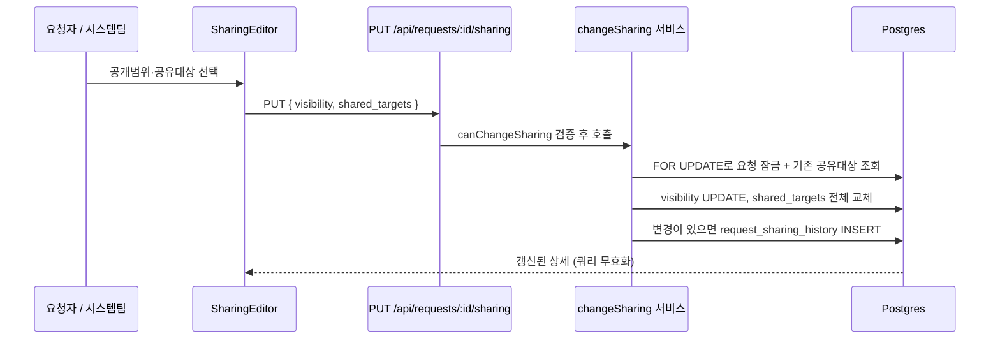

# 공유 설정 사후 수정

## 배경

요청을 처리하다 보면 접수 시점에 예상하지 못한 부서·기관이 그 요청을 봐야 한다는 사실이 드러난다. 그런데 지금은 그럴 방법이 없다.

- **공유 대상**(`request_shared_targets`)은 접수 시점(`POST /api/requests`, `server/src/routes/requests.ts:100-106`)에만 insert되고, 이후 변경하는 API가 없다. 요청 상세는 조회만 한다(`server/src/routes/request-detail.ts:18`).
- **공개범위**(`visibility`)는 편집 폼에 있지만 본문 편집과 같은 규칙(`canEdit`)에 묶여 있다. 요청자는 접수 상태에서만 고칠 수 있어서, 진행중이 된 뒤에는 자기 요청의 공개 범위조차 넓힐 수 없다.

## 목표

처리 중·처리 후에도 "누가 이 요청을 볼 수 있는가"를 조정할 수 있게 한다.

## 비목표

- 개인 단위 공유(특정 사람 한 명에게만 공유). 지금처럼 직무·부서 단위만 다룬다.
- 새로 공유된 사람들에게 알림 발송. 공유 대상은 직무·부서 단위라 한 번 추가하면 수십 명에게 알림이 가므로 보내지 않는다.
- 본문 편집 권한 확대. 제목·본문·긴급도·희망완료일의 편집 규칙은 그대로 둔다.

---

## 1. 권한 — 본문 편집과 분리한다

공유 설정 변경 권한을 본문 편집(`canEdit`)에서 떼어낸다.

| 대상 | 규칙 |
|------|------|
| 본문 편집 (제목·본문·긴급도·희망완료일) | 시스템팀(`canProcess`) 또는 (요청자 본인 && 접수) — **현행 유지** |
| **공유 설정 (공개범위 + 공유 대상)** | 시스템팀(`canProcess`) 또는 **요청자 본인 (상태 무관, 종결 후에도)** |

근거: 본문을 바꾸는 것은 처리 내용 자체를 바꾸지만, 공유 범위를 바꾸는 것은 "누가 볼 수 있는가"만 바꾼다. 처리 이력을 훼손하지 않으므로 더 넓게 열어도 안전하다. 그리고 "처리해보니 다른 부서도 봐야 하더라"는 상황은 정의상 접수 이후에 발생한다.

서버 `server/src/authz.ts`에 판정 함수를 추가한다:

```ts
export function canChangeSharing(u: CurrentUser, requesterId: string | null): boolean
```

`canProcess(u) || requesterId === u.id`를 반환한다. 클라이언트 사본은 `src/lib/permissions.ts`에 같은 규칙으로 둔다.

## 2. API — 전용 엔드포인트

```
PUT /api/requests/:id/sharing
body: { visibility: 'private'|'dept'|'function'|'org'|'shared',
        shared_targets: Array<{ target_type: 'function'|'dept', target_value: string }> }
```

기존 `PATCH /api/requests/:id`에 얹지 않는다. 그 라우트는 필드마다 권한 규칙이 이미 세 갈래(상태 변경 / 보드 변경 / 내용 편집)로 갈려 있고, 여기에 네 번째 규칙을 섞으면 판정이 뒤엉킨다.

- **권한**: `canChangeSharing`. 위반 시 403.
- **공유 대상은 전체 교체**다. 넘긴 목록이 곧 최종 상태이므로 추가·제거가 한 번의 호출로 처리된다. 서버는 트랜잭션 안에서 기존 행을 지우고 새로 넣는다.
- **`visibility`는 기존 PATCH 경로에서 제거**한다. 두 경로가 같은 컬럼을 다른 권한 규칙으로 쓰면 낮은 쪽이 우회로가 된다.
- 검증: `visibility`는 5개 값 중 하나, `target_type`은 `function` 또는 `dept`, `target_value`는 각각 `FUNCTION_TARGETS`(6종)와 `기관|직무` 형식이어야 한다. 위반 시 400.
- 종결된 요청도 허용한다(요청자가 완료된 건을 다른 부서에 참고용으로 공유할 수 있어야 한다).

## 3. 이력 — 누가 언제 공유를 바꿨는가

공유 변경은 열람 권한의 변경이므로 추적 가능해야 한다. "이 요청을 왜 저 팀이 보고 있지?"에 답할 수 있어야 한다.

기존 `request_status_history`는 상태 전이 전용이라 재사용하지 않는다. 새 테이블을 만든다.

```
request_sharing_history
  id              bigint PK
  request_id      bigint NOT NULL → requests(id) ON DELETE CASCADE
  changed_by      uuid → users(id)
  changed_at      timestamptz NOT NULL DEFAULT now()
  from_visibility text
  to_visibility   text
  added           jsonb NOT NULL DEFAULT '[]'   -- [{target_type, target_value}, …]
  removed         jsonb NOT NULL DEFAULT '[]'
```

- 공개범위와 공유 대상이 **둘 다 그대로면 행을 남기지 않는다**(무의미한 이력 방지).
- `added`/`removed`는 서버가 기존 목록과 새 목록을 비교해 계산한다. 클라이언트가 보낸 값을 믿지 않는다.
- 감사 컬럼 `created_at` 대신 `changed_at`을 쓰는 것은 `request_status_history`의 기존 관례를 따르는 것이다.

요청 상세의 활동 타임라인(`src/features/requests/RequestDetail.tsx`)에 `sharing` 종류를 추가해 상태 변경·코멘트·첨부와 시간순으로 섞어 보여준다. 한 행에 "공유 범위 변경 · 배움_교학팀 추가 · 공개범위 부서 → 기관" 형태로 요약한다.

## 4. 화면

요청 상세의 공개범위 뱃지 옆에 **"공유 범위 수정"** 버튼을 둔다. `canChangeSharing`인 사용자에게만 보인다.

버튼을 누르면 접수 폼과 같은 컨트롤이 열린다 — 공개범위 select + 직무 체크박스(6종) + 세부부서 체크박스(기관별 그룹). 접수 폼의 공유 대상 선택 UI(`src/features/requests/RequestForm.tsx`)를 컴포넌트로 추출해 두 화면이 공유한다. 선택 규칙이 두 벌이 되면 접수와 수정의 동작이 갈라진다.

본문 편집 폼과 **합치지 않는다**. 권한 조건이 다르기 때문이다 — 진행중인 요청에서 요청자는 본문 편집 버튼은 못 보지만 공유 범위 수정 버튼은 봐야 한다.

## 5. 데이터 흐름



## 6. 오류 처리

| 상황 | 응답 |
|------|------|
| 권한 없음 | 403 |
| 잘못된 visibility·target 값 | 400 |
| 존재하지 않는 요청 | 404 |

클라이언트는 오류를 `role="alert"` 영역에 한국어로 표시한다.

## 7. 테스트

| 대상 | 방식 |
|------|------|
| 권한 | `server/scripts/test-sharing.ts` 신설 — 요청자 본인은 종결 건에서도 200, 무관한 staff는 403, 시스템팀은 200 |
| 전체 교체 | 대상 추가·제거가 한 번의 PUT으로 반영되는지 |
| 이력 | 변경 시 `request_sharing_history`에 added/removed가 정확히 기록되는지. 변경이 없으면 행이 남지 않는지 |
| 열람 반영 | 공유 대상을 추가하면 그 부서 사용자의 목록(`visibilityFilter`)에 실제로 나타나는지 — **이 기능의 존재 이유이므로 반드시 검증한다** |
| 회귀 | `visibility`를 기존 PATCH로 바꾸려 하면 거부되는지(우회로 차단) |

## 8. 문서 동기화

`docs/reference/db-schema.md`(신규 테이블·엔드포인트), `docs/reference/requirements.md`(공유 설정 권한·화면), `CHANGELOG.md`.
